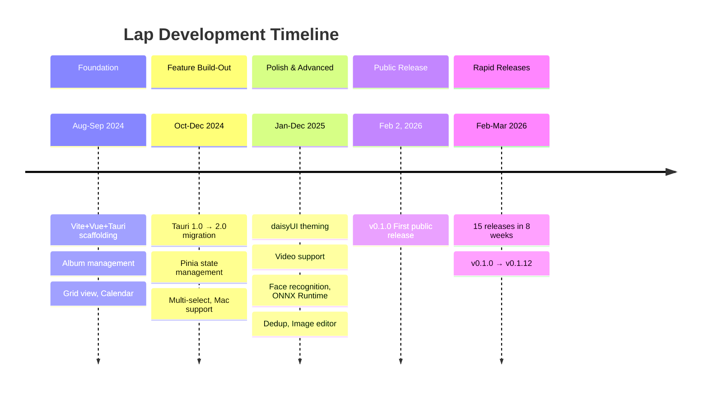

# Project Overview

## Summary

Lap is an open-source desktop photo manager for macOS, Windows, and Linux. Privacy-focused, offline-first, with local AI capabilities (face recognition, image search, smart tags).

### 사진 관리 앱이란? (Finder/탐색기와 뭐가 다른가요?)

Finder나 Windows 탐색기로도 사진을 볼 수 있습니다. 그런데 왜 별도의 사진 관리 앱이 필요할까요?

**비유**: Finder는 "서류 캐비넷"이고, Lap은 "사진 앨범 + 비서"입니다.

- 서류 캐비넷(Finder)은 파일을 폴더별로 정리만 해줍니다. 사진을 찾으려면 폴더를 하나하나 열어봐야 합니다.
- 사진 앨범 + 비서(Lap)는 날짜별, 장소별, 인물별로 자동 분류하고, "바다 사진 찾아줘"라고 말하면 AI가 찾아줍니다.


| 기능         | Finder/탐색기 | Lap                |
| ---------- | ---------- | ------------------ |
| 폴더 탐색      | O          | O                  |
| 썸네일 미리보기   | 기본적        | 고속 캐싱, RAW 지원      |
| 얼굴 인식      | X          | O (로컬 AI)          |
| AI 이미지 검색  | X          | O ("sunset" 검색 가능) |
| EXIF 메타데이터 | 제한적        | 카메라, 렌즈, GPS 등 상세  |
| 중복 사진 탐지   | X          | O                  |
| 사진 편집      | 별도 앱 필요    | 내장 에디터             |


### Offline-First가 뭔가요?

**쉽게 말하면**: 인터넷 없이도 모든 기능이 동작합니다. Google Photos나 iCloud는 클라우드에 사진을 올려야 AI 기능을 쓸 수 있지만, Lap은 내 컴퓨터 안에서 AI가 돌아갑니다.

**왜 이렇게 했을까?**

- **프라이버시**: 내 사진이 외부 서버로 전송되지 않습니다. 얼굴 인식도 내 컴퓨터에서만 실행됩니다.
- **비용**: 클라우드 저장소 비용이 없습니다. 수만 장의 사진도 무료로 관리할 수 있습니다.
- **속도**: 네트워크 지연 없이 바로 응답합니다.
- **소유권**: 내 데이터는 내 컴퓨터에만 있으므로, 서비스가 종료되어도 사진을 잃지 않습니다.
- **Repository**: [https://github.com/julyx10/lap](https://github.com/julyx10/lap)
- **Author**: julyx10
- **License**: GPL-3.0-or-later
- **Current Version**: 0.1.12

## Tech Stack


| Layer             | Technology                               |
| ----------------- | ---------------------------------------- |
| Desktop Framework | Tauri 2.0 (Rust)                         |
| Frontend          | Vue 3 + Vite + Tailwind CSS + daisyUI    |
| Database          | SQLite (rusqlite, bundled)               |
| State Management  | Pinia (persisted)                        |
| Image Processing  | LibRaw (RAW), image crate                |
| Video Processing  | FFmpeg (ffmpeg-next)                     |
| AI Inference      | ONNX Runtime (ort crate)                 |
| Search            | CLIP (text/image similarity)             |
| Face Recognition  | InsightFace (RetinaFace + MobileFaceNet) |
| Map               | Leaflet                                  |
| Video Player      | video.js                                 |
| i18n              | vue-i18n (9 languages)                   |


### 왜 이 기술을 선택했나?

각 기술이 선택된 이유를 이해하면 프로젝트의 설계 철학이 보입니다.

**Tauri 2.0 (Rust) vs Electron**

- Electron(VS Code, Slack 등이 사용)은 Chromium 브라우저 전체를 앱에 포함시켜서 설치 파일이 100MB 이상입니다.
- Tauri는 OS의 기본 WebView를 사용하므로 설치 파일이 10~20MB 수준입니다.
- 백엔드가 Rust로 작성되어 C/C++ 수준의 성능을 내면서도 메모리 안전성이 보장됩니다.
- 쉽게 말하면: Electron은 "배달 트럭에 주방까지 실어 보내는 것", Tauri는 "레시피만 보내고 집에 있는 주방을 쓰는 것"입니다.

**Vue 3 + Vite**

- React보다 학습 곡선이 완만하고, 단일 파일 컴포넌트(SFC)로 HTML/CSS/JS를 한 파일에 관리할 수 있습니다.
- Vite는 빌드 도구인데, webpack보다 개발 서버 시작이 수십 배 빠릅니다. 파일을 수정하면 브라우저에 거의 즉시 반영됩니다.

**SQLite (내장)**

- PostgreSQL이나 MySQL은 별도의 서버 프로세스가 필요하지만, SQLite는 하나의 파일(.db)로 동작합니다.
- 데스크탑 앱에 이상적: 사용자가 DB 서버를 설치할 필요가 없습니다.
- "bundled"라는 것은 SQLite 라이브러리 자체를 앱 안에 포함시켜서 빌드한다는 뜻입니다.

**ONNX Runtime (AI)**

- PyTorch나 TensorFlow는 Python 환경이 필요하고 무겁지만, ONNX Runtime은 C++/Rust에서 직접 AI 모델을 실행할 수 있습니다.
- 사용자가 Python을 설치할 필요가 없습니다. 앱만 설치하면 AI가 바로 동작합니다.

**CLIP (검색)**

- OpenAI가 만든 모델로, 텍스트와 이미지를 같은 공간의 벡터로 변환합니다.
- "sunset"이라고 입력하면 노을 사진을 찾아주는 원리: "sunset"이라는 텍스트 벡터와 노을 사진의 이미지 벡터가 가까운 거리에 위치하기 때문입니다.

**LibRaw**

- 전문 카메라(Canon CR3, Nikon NEF 등)의 RAW 파일을 읽으려면 각 제조사별 디코더가 필요합니다.
- LibRaw는 20개 이상의 RAW 포맷을 지원하는 C++ 라이브러리입니다. Rust에서 FFI(Foreign Function Interface)로 호출합니다.

## Directory Structure

```
lap/
├── src-tauri/           # Rust backend (~11,700 lines)
│   ├── src/             # 17 Rust modules
│   ├── build.rs         # LibRaw/libjpeg-turbo compilation
│   ├── resources/models/ # ONNX AI models
│   └── third_party/     # LibRaw, libjpeg-turbo submodules
├── src-vite/            # Vue frontend
│   ├── src/components/  # 42 Vue components
│   ├── src/views/       # 4 page views
│   ├── src/stores/      # 3 Pinia stores
│   ├── src/common/      # API, utils, router, types
│   └── src/locales/     # 9 language files
├── docs/                # VitePress documentation site
├── scripts/             # Model download scripts
└── .github/workflows/   # CI/CD (release, PR build, docs deploy)
```

## Development Timeline




| Period       | Phase             | Highlights                                                                          |
| ------------ | ----------------- | ----------------------------------------------------------------------------------- |
| Aug-Sep 2024 | Foundation        | Vite+Vue+Tauri scaffolding, album management, grid view, calendar                   |
| Oct-Dec 2024 | Feature Build-Out | Tauri 1.0 → 2.0 migration, Pinia, multi-select, Mac support                         |
| Jan-Dec 2025 | Polish & Advanced | daisyUI theming, video support, face recognition, ONNX Runtime, dedup, image editor |
| Feb 2, 2026  | v0.1.0            | First public release                                                                |
| Feb-Mar 2026 | Rapid Releases    | 15 releases in 8 weeks (v0.1.0 → v0.1.12)                                           |


## Release History (v0.1.x)


| Version | Date   | Key Changes                                         |
| ------- | ------ | --------------------------------------------------- |
| v0.1.0  | Feb 2  | First public release                                |
| v0.1.1  | Feb 3  | Face recognition model updates                      |
| v0.1.2  | Feb 4  | Touchpad gesture handling                           |
| v0.1.3  | Feb 8  | Auto-update, VitePress website                      |
| v0.1.4  | Feb 11 | Gallery view revamp (justified layout)              |
| v0.1.5  | Feb 16 | Windows compatibility, filmstrip preview            |
| v0.1.6  | Feb 22 | Image editor presets/adjustments                    |
| v0.1.7  | Mar 1  | Dedup, split view, ratings, smart tags              |
| v0.1.8  | Mar 8  | Image comparison mode, save-as                      |
| v0.1.9  | Mar 11 | Crash recovery, background scan                     |
| v0.1.10 | Mar 15 | Interface scaling, lens inference                   |
| v0.1.11 | Mar 22 | Raw/TIFF support (libraw), printing                 |
| v0.1.12 | Mar 30 | Index recovery, favorite folders, thumb:// protocol |


## Stats

- **Total commits**: 614
- **Primary contributor**: julyx10 (~610 commits)
- **Rust backend**: ~11,700 lines across 17 modules
- **Frontend components**: 42 Vue components
- **Tauri commands**: 98 IPC commands
- **Supported formats**: 30+ image/RAW + 4 video formats
- **Languages**: 9 (en, zh, es, fr, de, ja, ko, ru, pt)

