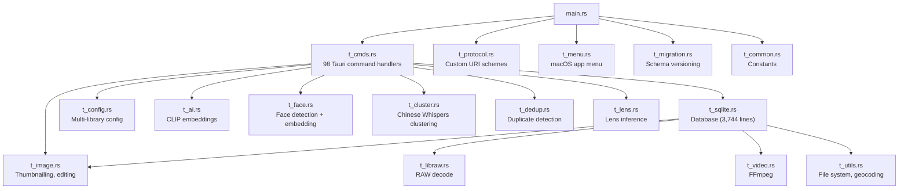
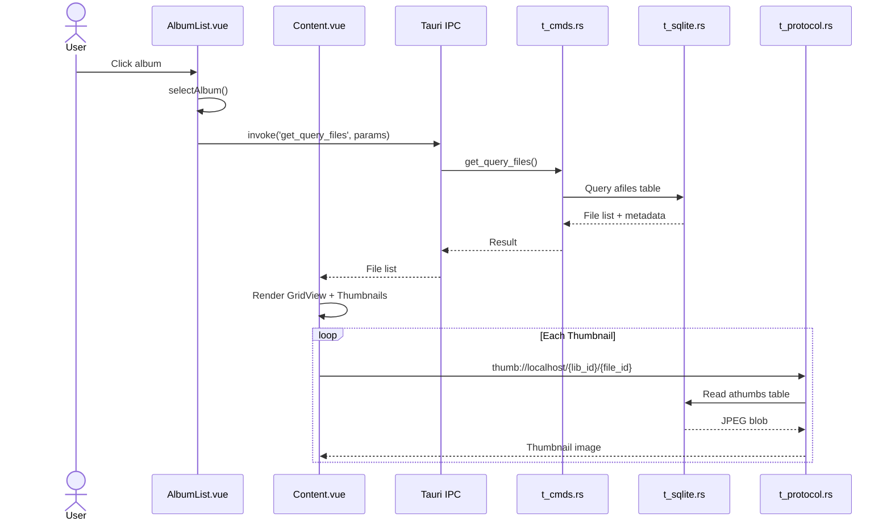
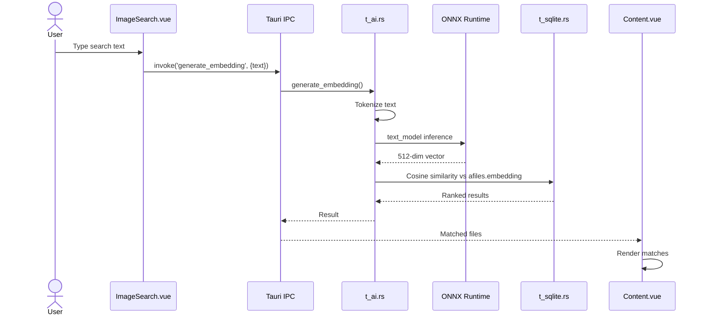
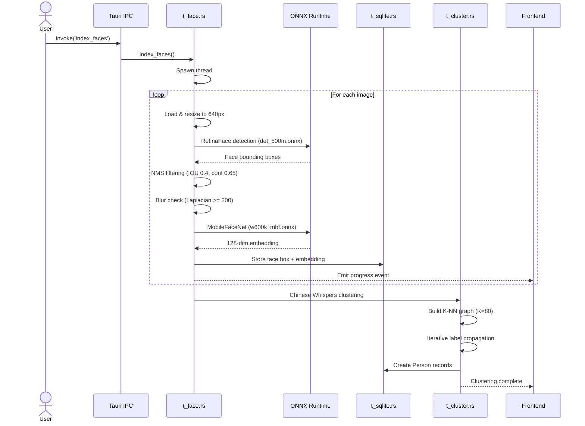
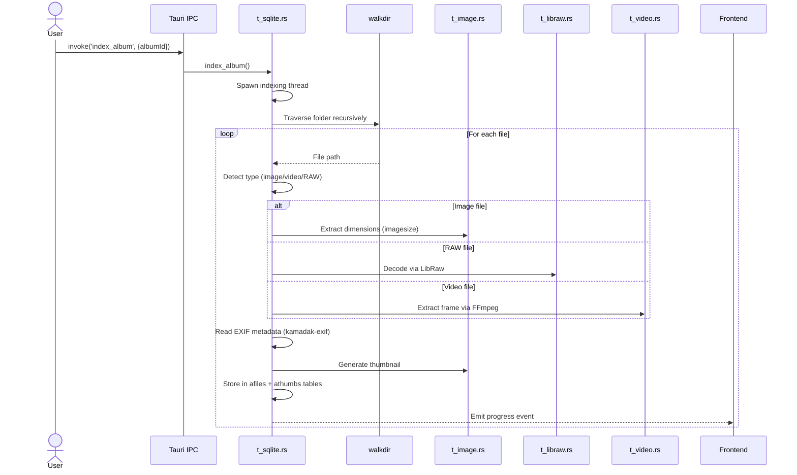

# Architecture

## High-Level Overview

### 레스토랑에 비유하면 (전체 구조 이해하기)

Lap의 구조를 레스토랑에 비유해보겠습니다.

| 레스토랑 | Lap | 역할 |
|---------|-----|------|
| **식당 홀 (Dining Room)** | Vue 3 Frontend | 손님(사용자)이 보는 공간. 메뉴판(UI)을 보고 주문(클릭)합니다. |
| **주방 (Kitchen)** | Rust Backend | 실제 요리(데이터 처리)가 일어나는 곳. 손님은 주방 안을 볼 수 없습니다. |
| **서빙 창구 (Service Window)** | Tauri IPC (invoke/listen) | 홀과 주방 사이의 통신 창구. 주문서가 오가는 곳입니다. |
| **레시피북 (Recipe Book)** | SQLite Database | 모든 데이터(사진 메타데이터, 앨범 정보 등)가 저장된 곳입니다. |
| **AI 소믈리에** | ONNX Models (CLIP, Face) | 와인을 추천하듯, 사진을 분석하고 검색을 도와줍니다. |

**왜 프론트엔드와 백엔드를 분리하나?**

쉽게 말하면, 식당 홀과 주방을 분리하는 이유와 같습니다:
- **역할 분담**: 홀 직원(Vue)은 손님 응대에 집중하고, 주방(Rust)은 요리에 집중합니다. 코드도 마찬가지로, UI 로직과 데이터 처리 로직을 분리하면 각각 독립적으로 수정할 수 있습니다.
- **성능**: 무거운 작업(이미지 처리, AI 추론)은 Rust가 처리합니다. JavaScript로 하면 수십 배 느릴 수 있습니다.
- **안전성**: Rust는 메모리 안전성을 컴파일 시점에 보장합니다. 사진 수만 장을 처리할 때 메모리 누수나 크래시를 방지합니다.

```mermaid
graph TB
    subgraph Frontend["Vue 3 Frontend"]
        Views["Views<br/>(4 pages)"]
        Components["Components<br/>(42 files)"]
        Stores["Pinia Stores<br/>(config/lib/ui)"]
    end

    subgraph IPC["Tauri IPC"]
        Invoke["invoke() / listen()<br/>98 commands"]
    end

    subgraph Backend["Rust Backend"]
        t_cmds["t_cmds<br/>(commands)"]
        t_sqlite["t_sqlite<br/>(database)"]
        t_config["t_config<br/>(libraries)"]
        t_image["t_image<br/>(images)"]
        t_video["t_video<br/>(ffmpeg)"]
        t_libraw["t_libraw<br/>(RAW decode)"]
        t_ai["t_ai<br/>(CLIP)"]
        t_face["t_face<br/>(detect)"]
        t_cluster["t_cluster<br/>(clustering)"]
        t_dedup["t_dedup<br/>(hashing)"]
        t_utils["t_utils<br/>(fs/geo)"]
        t_protocol["t_protocol<br/>(thumb/preview)"]
    end

    subgraph Storage["Storage & Models"]
        SQLite["SQLite<br/>(metadata)"]
        LibRaw["LibRaw<br/>(C++ shim)"]
        ONNX["ONNX Models<br/>(CLIP, Face)"]
    end

    Frontend --> IPC --> Backend
    Backend --> Storage
```



## Module Dependency Graph



## Data Flow

### 유저가 앨범을 클릭하면 내부에서 무슨 일이 벌어지나?

아래의 Photo Browsing 흐름을 단계별로 자세히 설명합니다.

1. **사용자가 왼쪽 사이드바에서 "여행" 앨범을 클릭합니다.**
   - `AlbumList.vue` 컴포넌트가 클릭 이벤트를 감지합니다.

2. **프론트엔드가 백엔드에 "주문서"를 보냅니다.**
   - `invoke('get_query_files', { albumId: 5, offset: 0, limit: 100 })` 호출
   - 쉽게 말하면: "5번 앨범의 파일 목록을 0번부터 100개 주세요"라는 요청입니다.
   - `invoke()`는 Tauri의 IPC(Inter-Process Communication) 함수입니다. JavaScript에서 Rust 함수를 호출하는 다리 역할을 합니다.

3. **백엔드 주방에서 요리가 시작됩니다.**
   - `t_cmds.rs`가 요청을 받아서 `t_sqlite.rs`에 전달합니다.
   - SQLite DB에서 `SELECT * FROM afiles WHERE album_id = 5 LIMIT 100` 같은 쿼리가 실행됩니다.
   - 파일 이름, 촬영 날짜, 크기, 썸네일 ID 등의 메타데이터가 반환됩니다.

4. **프론트엔드가 결과를 받아 화면에 그립니다.**
   - `Content.vue`가 파일 목록을 받아서 `GridView` 컴포넌트로 전달합니다.
   - 각 사진은 `Thumbnail` 컴포넌트로 렌더링됩니다.

5. **썸네일 이미지가 로딩됩니다.**
   - 각 썸네일의 `src`가 `thumb://localhost/1/42` 같은 커스텀 프로토콜 URL입니다.
   - Tauri가 이 URL을 가로채서 `t_protocol.rs`에 전달합니다.
   - `t_protocol.rs`가 `athumbs` 테이블에서 JPEG 바이너리를 읽어 반환합니다.
   - 쉽게 말하면: `http://`가 웹서버에서 이미지를 가져오듯, `thumb://`은 로컬 DB에서 이미지를 가져옵니다.

### Photo Browsing



```
User clicks album
  → AlbumList.vue dispatches selectAlbum()
  → invoke('get_query_files', params)
  → t_cmds.rs → t_sqlite.rs queries afiles table
  → Returns file list with metadata
  → Content.vue renders GridView with Thumbnails
  → Each Thumbnail loads via thumb://localhost/{lib_id}/{file_id}
  → t_protocol.rs serves JPEG blob from athumbs table
```

### AI Image Search



```
User types search text
  → ImageSearch.vue calls searchImages(text)
  → invoke('generate_embedding', { text })
  → t_ai.rs tokenizes → ONNX text_model inference → 512-dim vector
  → t_sqlite.rs cosine similarity against afiles.embedding
  → Returns ranked results
  → Content.vue renders matches
```

### Face Recognition Pipeline



```
User triggers face indexing
  → invoke('index_faces')
  → t_face.rs spawns thread
  → For each image:
    1. Load image → resize to 640px
    2. RetinaFace detection (det_500m.onnx)
    3. NMS filtering (IOU 0.4, confidence 0.65)
    4. Blur check (Laplacian variance ≥ 200)
    5. MobileFaceNet embedding (w600k_mbf.onnx) → 128-dim vector
    6. Store face box + embedding in faces table
  → t_cluster.rs Chinese Whispers clustering
    1. Build K-NN graph (K=80)
    2. Iterative label propagation
    3. Create Person records
  → Emit progress events to frontend
```

### Album Indexing



```
User adds album folder
  → invoke('index_album', { albumId })
  → t_sqlite.rs spawns indexing
  → walkdir traverses folder recursively
  → For each file:
    1. Detect type (image/video/RAW)
    2. Extract dimensions (imagesize / LibRaw / FFmpeg)
    3. Read EXIF metadata (kamadak-exif)
    4. Generate thumbnail
    5. Store in afiles + athumbs tables
  → Emit progress events
```

## Frontend Architecture

```
src-vite/src/
├── main.js ──────── App init, Pinia, i18n, router, Tauri events
├── App.vue ──────── Theme, scaling, crash recovery, lifecycle
├── views/
│   ├── Home.vue ─── Main library view (sidebar + content)
│   ├── ImageViewer.vue ── Split view comparison
│   ├── Settings.vue ───── App configuration
│   └── PrintView.vue ──── Print layout
├── stores/
│   ├── configStore.js ── App settings (persisted to localStorage)
│   ├── libraryStore.js ─ Per-library state (persisted to backend)
│   └── uiStore.js ────── Transient UI state
└── common/
    ├── api.js ──── 105+ functions wrapping invoke()
    ├── utils.ts ── Formatting, paths, OS detection
    ├── layout.ts ─ Justified/linear row layout algorithms
    └── router.js ─ 4 routes
```

## State Management

### State Management가 뭔가요? (Pinia를 처음 접하는 분을 위해)

**비유**: 여러 직원이 함께 일하는 사무실의 **공유 게시판**이라고 생각하면 됩니다.

Vue 컴포넌트가 42개나 있는데, 이들이 같은 데이터를 공유해야 할 때가 많습니다. 예를 들어:
- 사용자가 "여행" 앨범을 선택하면, `AlbumList.vue`도 알아야 하고, `Content.vue`도 알아야 하고, `StatusBar.vue`도 알아야 합니다.
- 이 정보를 컴포넌트끼리 일일이 전달하면 코드가 복잡해집니다 (이것을 "prop drilling"이라고 합니다).

**Pinia**는 이 공유 데이터를 한 곳에서 관리합니다:
- 쉽게 말하면: 게시판에 "현재 선택된 앨범: 여행"이라고 적어놓으면, 어떤 직원(컴포넌트)이든 게시판을 보면 됩니다.
- 게시판 내용이 바뀌면 보고 있던 모든 직원에게 자동으로 알림이 갑니다 (Vue의 반응형 시스템).

**왜 Store가 3개로 나뉘어 있나요?**
- `configStore`: 앱 전체 설정 (언어, 테마, 그리드 크기 등). 브라우저의 localStorage에 저장되어 앱을 다시 열어도 유지됩니다.
- `libraryStore`: 각 라이브러리별 상태 (어떤 앨범을 보고 있었는지 등). 백엔드 JSON 파일에 저장됩니다.
- `uiStore`: 현재 세션에서만 필요한 임시 상태 (어떤 패널이 열려있는지 등). 앱을 닫으면 사라집니다.

| Store | Scope | Persistence | Purpose |
|-------|-------|-------------|---------|
| configStore | Global | localStorage | App settings, editor state, grid config |
| libraryStore | Per-library | Backend JSON | Album/folder selection, search history |
| uiStore | Session | None | Active pane, input stack, file versions |

## Communication Patterns

### IPC(Inter-Process Communication)란?

쉽게 말하면, 프론트엔드(JavaScript)와 백엔드(Rust)는 서로 다른 세계에 살고 있습니다. 웹 브라우저 안의 JavaScript는 직접 파일을 읽거나, DB에 접근하거나, AI 모델을 실행할 수 없습니다. 그래서 "서빙 창구"(IPC)를 통해 소통합니다.

통신 방식은 2가지입니다:

**1. invoke() - 프론트엔드가 백엔드에 요청 (주문하기)**
```javascript
// Synchronous request-response
const result = await invoke('command_name', { args });
```
- 웹 개발의 `fetch('/api/...')`와 비슷하지만, HTTP 대신 프로세스 내부 통신을 사용해서 훨씬 빠릅니다.
- `await`을 사용하므로 결과가 올 때까지 기다립니다.
- 예: `await invoke('get_all_albums')` = "모든 앨범 목록 주세요"

**2. listen() - 백엔드가 프론트엔드에 알림 (주방에서 벨 울리기)**
```javascript
// Event subscription
listen('event_name', (event) => { /* handle event.payload */ });
```
- 얼굴 인식처럼 오래 걸리는 작업에서 진행률을 알려줄 때 사용합니다.
- 예: 1000장의 사진을 스캔하면서 "200/1000 완료"라는 이벤트를 계속 보냅니다.
- 쉽게 말하면: 음식 주문 후 진동벨이 울릴 때까지 기다리는 것과 같습니다. `invoke()`는 카운터에서 기다리는 것이고, `listen()`은 진동벨을 받는 것입니다.

### Custom URI Protocols
- `thumb://localhost/{lib_id}/{file_id}` — Cached thumbnail (JPEG blob)
- `preview://localhost/{lib_id}/{file_id}` — Full-quality preview (decoded on demand)

쉽게 말하면: 브라우저가 `https://example.com/image.jpg`를 로딩하듯, Tauri 앱은 `thumb://localhost/1/42`를 로딩합니다. 다만 인터넷이 아니라 로컬 DB에서 데이터를 가져옵니다. 이렇게 하면 `` 같은 HTML 태그로 썸네일을 자연스럽게 표시할 수 있습니다.
