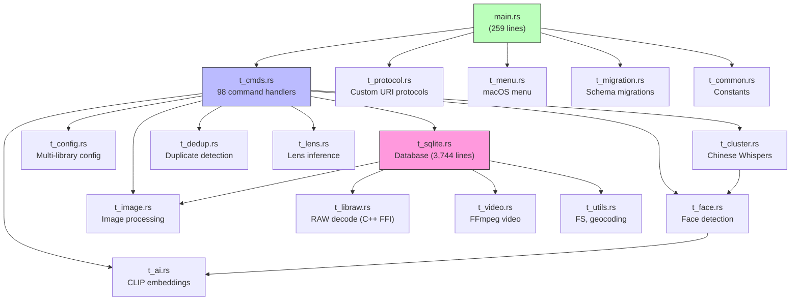

# Rust Backend

## 각 모듈을 사람에 비유하면

Rust 백엔드에는 17개의 모듈이 있습니다. 각 모듈을 회사의 직원에 비유하면 이해가 쉽습니다:

| 모듈 | 비유 | 하는 일 |
|------|------|---------|
| `t_sqlite.rs` | **기록원 (Archivist)** | 모든 데이터를 기록하고 찾아주는 사람. 가장 바쁜 직원(3,744줄)입니다. |
| `t_cmds.rs` | **안내 데스크 (Reception)** | 프론트엔드의 요청을 받아서 적절한 담당자에게 전달합니다. |
| `t_image.rs` | **사진사 (Photographer)** | 사진 크기 조절, 썸네일 생성, 이미지 편집을 담당합니다. |
| `t_face.rs` | **탐정 (Detective)** | 사진 속 얼굴을 찾아내고, 누구인지 식별합니다. |
| `t_ai.rs` | **번역가 (Translator)** | 텍스트와 이미지를 같은 언어(벡터)로 번역해서 비교할 수 있게 합니다. |
| `t_cluster.rs` | **분류 전문가 (Classifier)** | 탐정이 찾은 얼굴들을 "이건 같은 사람"이라고 묶어줍니다. |
| `t_dedup.rs` | **감사관 (Auditor)** | 중복된 파일을 찾아서 정리를 도와줍니다. |
| `t_config.rs` | **총무 (Admin)** | 라이브러리 설정, 앱 설정을 관리합니다. |
| `t_video.rs` | **영상 편집자 (Video Editor)** | FFmpeg를 사용해서 동영상 썸네일을 추출합니다. |
| `t_libraw.rs` | **필름 현상사 (Film Developer)** | 전문 카메라의 RAW 파일을 읽을 수 있는 이미지로 변환합니다. |
| `t_utils.rs` | **잡일 담당 (Utility)** | 파일 시스템 작업, GPS 좌표를 주소로 변환 등의 유틸리티 작업을 합니다. |
| `t_protocol.rs` | **배달원 (Courier)** | `thumb://`, `preview://` 프로토콜로 이미지를 배달합니다. |
| `t_lens.rs` | **장비 전문가 (Gear Expert)** | EXIF 데이터로 어떤 렌즈를 사용했는지 추론합니다. |
| `t_menu.rs` | **인테리어 (Decorator)** | macOS 메뉴바를 구성합니다. |
| `t_migration.rs` | **이사 전문가 (Migrator)** | DB 스키마가 변경될 때 데이터를 안전하게 이전합니다. |
| `t_common.rs` | **사전 (Dictionary)** | 지원하는 파일 포맷, 모델 경로 등의 상수를 정의합니다. |

## Module Dependency Graph



## Module Overview

| Module | Lines | Purpose |
|--------|-------|---------|
| `t_sqlite.rs` | 3,744 | Database layer (largest module) |
| `t_utils.rs` | 1,282 | File system, geocoding, permissions |
| `t_cmds.rs` | 900 | 98 Tauri command handlers |
| `t_image.rs` | 898 | Image processing, thumbnailing |
| `t_face.rs` | 883 | Face detection + embedding |
| `t_dedup.rs` | 867 | Duplicate detection |
| `t_config.rs` | 748 | Multi-library configuration |
| `t_video.rs` | 484 | FFmpeg video processing |
| `t_libraw.rs` | 451 | RAW image decoding (C++ FFI) |
| `t_cluster.rs` | 282 | Face clustering (Chinese Whispers) |
| `main.rs` | 259 | Entry point, plugin/command registration |
| `t_lens.rs` | 248 | Lens metadata inference |
| `t_ai.rs` | 218 | CLIP embedding generation |
| `t_menu.rs` | 124 | macOS application menu |
| `t_migration.rs` | 117 | Database schema migrations |
| `t_protocol.rs` | 104 | Custom URI protocols |
| `t_common.rs` | 60 | Constants |

## Startup Sequence

### 앱을 켜면 무슨 일이 벌어지나?

앱 아이콘을 더블클릭한 순간부터 화면이 보이기까지, 내부에서는 다음과 같은 일이 순서대로 일어납니다. 레스토랑 오픈 준비에 비유합니다.

```mermaid
sequenceDiagram
    participant App as main()
    participant Plugins as Tauri Plugins
    participant State as Managed State
    participant Setup as .setup() hook
    participant DB as SQLite
    participant AI as ONNX Models
    participant Loop as Event Loop

    App->>App: 1. Panic hook setup
    App->>Plugins: 2. Register plugins
    Note right of Plugins: window-state, shell, fs,<br/>dialog, process, updater
    App->>State: 3. Initialize state
    Note right of State: AiState, FaceState,<br/>IndexCancellation, DedupState
    App->>Setup: 4. Run .setup() hook
    Setup->>Setup: Set app identifier
    Setup->>Setup: Install macOS menu
    Setup->>DB: create_db()
    DB-->>Setup: DB ready (created/migrated)
    Setup->>Setup: restore_album_scopes()
    Setup->>AI: Load CLIP models
    Note right of AI: text_model.onnx<br/>vision_model.onnx
    AI-->>Setup: Models loaded
    App->>App: 5. Window event handling
    App->>App: 6. Menu event handling
    App->>App: 7. Register 98 commands
    App->>Loop: 8. app.run()
    Note right of Loop: Event loop started
```

```
1. main() → Panic hook setup
2. Plugin registration → window-state, shell, fs, dialog, process, updater, analytics
3. State initialization → AiState, FaceState, IndexCancellation, DedupState
4. .setup() hook:
   ├── Set app identifier
   ├── Install macOS menu
   ├── create_db() → Create/migrate SQLite database
   ├── restore_album_scopes() → Restore Tauri file permissions
   └── Load CLIP models (text_model.onnx + vision_model.onnx)
5. Window event handling → Close cascade
6. Menu event handling → macOS menu
7. invoke_handler → Register 98 commands
8. app.run() → Event loop
```

**단계별 설명:**

1. **Panic hook 설정** (비상 대응 매뉴얼 준비): 프로그램이 예상치 못한 오류로 크래시하면, 에러 정보를 기록하도록 설정합니다.

2. **Plugin 등록** (주방 도구 세팅): Tauri 플러그인들을 등록합니다. 파일 대화상자(dialog), 파일 시스템(fs), 자동 업데이트(updater) 등 OS 기능에 접근하기 위한 도구들입니다.

3. **State 초기화** (재료 준비): AI 엔진, 얼굴 인식 엔진 등의 상태 객체를 생성합니다. 아직 AI 모델을 로딩하지는 않고, 빈 그릇만 준비합니다.

4. **setup() 실행** (가장 중요한 단계):
   - DB 생성/마이그레이션: SQLite 파일이 없으면 새로 만들고, 기존 파일이면 스키마 버전을 확인해서 업그레이드합니다.
   - 파일 권한 복구: Tauri의 보안 모델 때문에, 이전에 사용자가 허용한 폴더 접근 권한을 복원합니다.
   - CLIP 모델 로딩: AI 검색용 모델 파일(text_model.onnx, vision_model.onnx)을 메모리에 올립니다. 이 과정이 수 초 걸릴 수 있습니다.

5-6. **이벤트 핸들러 등록** (직원 배치): 윈도우 닫기, 메뉴 클릭 등의 이벤트에 반응할 핸들러를 등록합니다.

7. **98개 커맨드 등록** (메뉴판 완성): 프론트엔드가 호출할 수 있는 98개의 Tauri 커맨드를 등록합니다.

8. **Event loop 시작** (영업 개시): 사용자 입력을 기다리는 무한 루프에 진입합니다.

## Tauri Commands (98 total)

### Tauri Command란?

쉽게 말하면, 웹 개발에서의 REST API 엔드포인트와 같은 것입니다. 다만 HTTP가 아니라 프로세스 내부 통신(IPC)을 사용합니다.

웹 앱에서 `fetch('/api/albums')`로 서버에 요청하듯, Tauri 앱에서는 `invoke('get_all_albums')`로 Rust 백엔드에 요청합니다.

| 웹 개발 | Tauri 데스크탑 앱 |
|---------|-----------------|
| `GET /api/albums` | `invoke('get_all_albums')` |
| `POST /api/album` + body | `invoke('add_album', { name, path })` |
| Express/FastAPI 라우터 | `t_cmds.rs`의 `#[tauri::command]` 함수 |

왜 이렇게 했을까? 보안 때문입니다. 프론트엔드(WebView)가 직접 파일 시스템이나 DB에 접근하면 보안 위험이 커집니다. 대신 명시적으로 정의된 98개의 커맨드만 허용해서, 프론트엔드가 할 수 있는 일을 제한합니다.

### Library Management (9)
`add_library`, `edit_library`, `remove_library`, `hide_library`, `reorder_libraries`, `switch_library`, `get_app_config`, `get_library_info`, `save_library_state`

### Album Management (10)
`add_album`, `edit_album`, `remove_album`, `recount_album`, `get_album`, `get_all_albums`, `set_album_display_order`, `set_album_cover`, `index_album`, `cancel_indexing`

### Folder Operations (9)
`select_folder`, `fetch_folder`, `count_folder`, `create_folder`, `rename_folder`, `move_folder`, `copy_folder`, `delete_folder`, `reveal_folder`

### File Operations (18)
- Query: `get_total_count_and_sum`, `get_query_count_and_sum`, `get_query_time_line`, `get_query_files`, `get_query_file_position`, `get_folder_files`, `get_folder_thumb_count`
- Manipulation: `edit_image`, `copy_edited_image`, `copy_image`, `rename_file`, `move_file`, `copy_file`, `delete_file`, `delete_db_file`
- Metadata: `edit_file_comment`, `get_file_thumb`, `get_file_info`, `update_file_info`

### Tag Operations (7)
`get_all_tags`, `create_tag`, `rename_tag`, `delete_tag`, `get_tags_for_file`, `add_tag_to_file`, `remove_tag_from_file`

### AI Features (3)
`check_ai_status`, `generate_embedding`, `search_similar_images`

### Face Recognition (9)
`index_faces`, `cancel_face_index`, `reset_faces`, `is_face_indexing`, `get_face_stats`, `get_persons`, `rename_person`, `delete_person`, `get_faces_for_file`

### Deduplication (7)
`dedup_start_scan`, `dedup_get_scan_status`, `dedup_cancel_scan`, `dedup_list_groups`, `dedup_get_group`, `dedup_set_keep`, `dedup_delete_selected`

### Favorites & Ratings (5)
`get_favorite_folders`, `get_folder_favorite`, `set_folder_favorite`, `set_file_favorite`, `set_file_rating`

### Calendar, Camera, Location (4)
`get_taken_dates`, `get_camera_info`, `get_lens_info`, `get_location_info`

### External & Recovery (5)
`open_external_url`, `get_external_app_display_name`, `open_file_with_app`, `get_index_recovery_info`, `clear_index_recovery_info`

## Managed State

### Managed State가 뭔가요?

Tauri의 Managed State는 여러 커맨드(함수)가 공유해야 하는 데이터를 안전하게 보관하는 곳입니다.

**비유**: 회사의 **공용 회의실 예약 시스템**이라고 생각하세요.
- AI 엔진은 무거운 자원(GPU 메모리, 모델 가중치)을 사용합니다.
- 두 개의 요청이 동시에 AI 엔진을 사용하면 충돌이 일어날 수 있습니다.
- 그래서 `Mutex`(뮤텍스)로 감싸서, 한 번에 하나의 요청만 접근하도록 합니다.

**Mutex를 쉽게 말하면**: 화장실 열쇠가 하나뿐인 것과 같습니다.
- 열쇠(lock)를 가진 사람만 화장실(AI 엔진)을 사용할 수 있습니다.
- 다른 사람은 열쇠가 반납될 때까지 줄을 서서 기다립니다.
- 이렇게 하면 두 사람이 동시에 들어가서 문제가 생기는 것(data race)을 방지합니다.

**Arc<AtomicBool>은 뭔가요?**
- "취소 버튼"이라고 생각하세요. 얼굴 인식이 진행 중일 때 사용자가 "취소"를 누르면, 이 값이 `false`에서 `true`로 바뀝니다.
- 작업 스레드는 주기적으로 이 값을 확인하고, `true`이면 작업을 중단합니다.
- `Arc`는 여러 스레드가 안전하게 공유할 수 있게 해주는 래퍼입니다.

```rust
// AI engine (CLIP models)
app.manage(Mutex::new(AiEngine::new()));

// Face detection/embedding engine
app.manage(Mutex::new(FaceEngine::new()));

// Cancellation tokens for indexing
app.manage(Arc::new(AtomicBool::new(false)));  // IndexCancellation
app.manage(Arc::new(AtomicBool::new(false)));  // FaceIndexingStatus

// Dedup scan state
app.manage(DedupState::new());
```

## Key Architectural Patterns

### Error Handling
- `Result<T, String>` throughout (simple string errors)
- Panic catching for FFmpeg and EXIF parsing
- No custom error types

### Concurrency
- `tokio::spawn_blocking()` for CPU-heavy work
- `std::thread::spawn()` for face indexing, dedup scanning
- `Mutex<T>` for shared state (AI engine, face engine)
- `Arc<AtomicBool>` for cancellation tokens
- Tauri event emitter for progress updates to frontend

### Database Access
- Lazy connection opening per query (no pool)
- Parameterized queries (SQL injection safe)
- `from_row()` trait methods for struct mapping

### File Format Detection
```rust
// t_common.rs
NORMAL_IMGS: &[&str] = &["jpg", "jpeg", "png", "gif", "bmp", "tif", "tiff", "webp", "avif", "heic", "heif"];
RAW_IMGS: &[&str] = &["cr2", "cr3", "crw", "nef", "nrw", "arw", ...];  // 20+ formats
VIDEOS: &[&str] = &["mp4", "mkv", "mov", "webm"];
```

## Build Script (build.rs)

1. Generate `build_info.rs` with `BUILD_UNIX_TIME` constant
2. Compile LibRaw from `third_party/LibRaw` source
3. Compile libjpeg-turbo from `third_party/libjpeg-turbo`
4. Compile `libraw_shim.cpp` (C++ wrapper)
5. Platform-specific linking:
   - macOS: `libc++`
   - Linux: `libstdc++`, `libz`
   - Windows: `ws2_32`

## Dependencies (Key)

| Crate | Version | Purpose |
|-------|---------|---------|
| tauri | 2 | Desktop framework |
| rusqlite | 0.32 | SQLite (bundled) |
| ort | 2.0-rc.10 | ONNX Runtime |
| image | 0.25 | Image processing |
| ffmpeg-next | 8.1 | Video (static on Unix) |
| tokenizers | 0.20 | CLIP text tokenization |
| kamadak-exif | 0.6 | EXIF metadata |
| reverse_geocoder | 4.1 | Lat/lon → location |
| walkdir | 2.5 | Directory traversal |
| blake3 | 1.8 | File hashing (dedup) |
| tokio | 1.50 | Async runtime |
