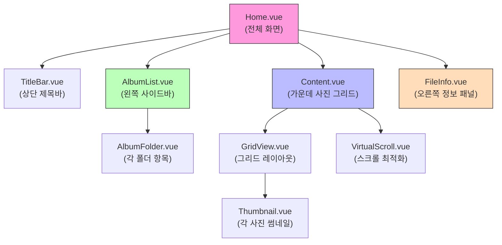
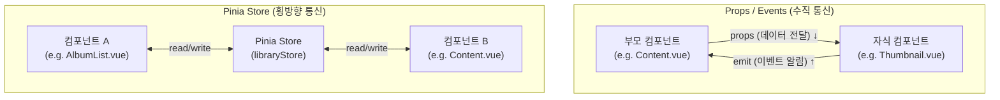
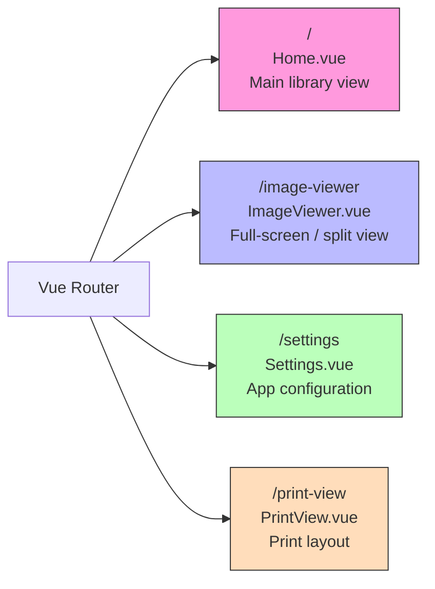

# Vue Frontend

## Vue 컴포넌트란? (레고 블록 비유)

Vue 앱은 **레고 블록**처럼 만들어집니다.

- 각 `.vue` 파일이 하나의 레고 블록입니다.
- 작은 블록(TButton, ToolTip)을 조합해서 중간 블록(Thumbnail, SearchBox)을 만듭니다.
- 중간 블록들을 조합해서 큰 블록(Content, AlbumList)을 만듭니다.
- 큰 블록들을 조합하면 최종 화면(Home.vue)이 됩니다.

예를 들어 Home.vue(메인 화면)는 이렇게 구성됩니다:



```
Home.vue (전체 화면)
├── TitleBar.vue (상단 제목바)
├── AlbumList.vue (왼쪽 사이드바)
│   └── AlbumFolder.vue (각 폴더 항목)
├── Content.vue (가운데 사진 그리드)
│   ├── GridView.vue (그리드 레이아웃)
│   │   └── Thumbnail.vue (각 사진 썸네일)
│   └── VirtualScroll.vue (스크롤 최적화)
└── FileInfo.vue (오른쪽 정보 패널)
```

### Composition API with `<script setup>` 이란?

Vue 3에는 컴포넌트를 작성하는 두 가지 방식이 있습니다:

**Options API** (Vue 2 스타일, 전통적):
```vue
<script>
export default {
  data() { return { count: 0 } },
  methods: { increment() { this.count++ } },
  computed: { double() { return this.count * 2 } }
}
</script>
```

**Composition API with `<script setup>`** (Lap이 사용하는 방식):
```vue
<script setup>
import { ref, computed } from 'vue'
const count = ref(0)
const increment = () => count.value++
const double = computed(() => count.value * 2)
</script>
```

쉽게 말하면: Options API는 "양식에 맞춰 칸을 채우는 것"이고, Composition API는 "자유롭게 코드를 쓰는 것"입니다. `<script setup>`은 보일러플레이트 코드를 더 줄여주는 단축 문법입니다.

### 컴포넌트가 서로 어떻게 대화하나?

42개의 컴포넌트가 서로 데이터를 주고받는 방법은 3가지입니다:

1. **Props (위에서 아래로)** - 부모가 자식에게 데이터를 전달
   - 비유: 부모가 아이에게 용돈을 주는 것
   - 예: `Content.vue`가 `GridView.vue`에게 파일 목록을 전달

2. **Events/Emit (아래에서 위로)** - 자식이 부모에게 알림
   - 비유: 아이가 "다 먹었어요!"라고 부모에게 알리는 것
   - 예: `Thumbnail.vue`에서 클릭하면 `Content.vue`에게 "이 사진이 선택됐어요" 이벤트 발생

3. **Pinia Store (횡방향)** - 아무 컴포넌트나 공유 데이터에 접근
   - 비유: 사무실 게시판에 정보를 적고 읽는 것
   - 예: `AlbumList.vue`에서 앨범을 바꾸면 `libraryStore`가 업데이트되고, `Content.vue`가 이를 감지해서 화면을 갱신



```
        [부모 컴포넌트]
         ↓ props    ↑ emit
        [자식 컴포넌트]

  [컴포넌트 A] ←→ [Pinia Store] ←→ [컴포넌트 B]
```

## Entry Point

**`main.js`** initializes in order:
1. Create Vue app → Pinia (persisted state) → config store
2. i18n setup (9 languages)
3. Vue Router
4. Global `$invoke` property (Tauri IPC)
5. Tauri event listeners for settings changes
6. Mount to `#app`

## Routes



| Path | Component | Purpose |
|------|-----------|---------|
| `/` | `Home.vue` | Main library view (sidebar + content grid) |
| `/image-viewer` | `ImageViewer.vue` | Full-screen image/split view comparison |
| `/settings` | `Settings.vue` | App configuration |
| `/print-view` | `PrintView.vue` | Print layout |

## Pinia Stores

> **비유**: Pinia Store는 **공유 칠판/게시판**입니다. 어떤 컴포넌트든 칠판에 글을 쓸 수 있고, 칠판을 보고 있던 다른 컴포넌트들은 내용이 바뀌면 자동으로 알게 됩니다.

### configStore (Global, persisted to localStorage)
- `main` — toolbar, max libraries, chunk size
- `content` — film strip pane height
- `leftPanel` / `rightPanel` — sidebar visibility, widths
- `infoPanel` — preview, metadata, map, histogram toggles
- `search` — AI search vs similar image, file type, sort
- `imageEditor` — brightness, contrast, saturation, crop, format, quality
- `settings` — language, appearance, scale, grid size, face thresholds, telemetry

### libraryStore (Per-library, persisted to backend)
- `album` — current album/folder selection, breadcrumbs
- `favorite`, `tag`, `calendar`, `camera`, `location`, `person` — filter selections
- `search` — text, history, filename
- `index` — scan status, queue, progress

### uiStore (Session only, not persisted)
- `activePane`, `inputStack`, `fileVersions`, `mapActive`, `activeAdjustments`

## Components (42 files)

### Core Layout

> **Content.vue가 159KB나 되는 이유는?**
> Content.vue는 앱의 "메인 화면" 그 자체입니다. 사진 그리드 표시, 정렬, 필터링, 다중 선택, 드래그 앤 드롭, 키보드 단축키, 무한 스크롤 등 사용자가 사진을 탐색할 때 필요한 거의 모든 로직이 여기에 있습니다. 마치 레스토랑에서 가장 큰 방이 메인 식당 홀인 것처럼, 가장 핵심적인 화면이라 가장 큽니다.
>
> 왜 이렇게 했을까? 이상적으로는 더 작은 컴포넌트로 분리하는 것이 좋지만, 사진 그리드의 상태(스크롤 위치, 선택된 파일들, 필터 조건 등)가 서로 밀접하게 연결되어 있어서 분리하면 오히려 복잡해질 수 있습니다. 개인 프로젝트에서 흔히 볼 수 있는 현실적인 트레이드오프입니다.

| Component | Size | Purpose |
|-----------|------|---------|
| `Content.vue` | 159K | Main media grid — filtering, sorting, selection (LARGEST) |
| `Image.vue` | 57K | Image display with zoom, pan, rotation |
| `EditImage.vue` | 68K | Crop, rotate, brightness/contrast/saturation editor |
| `ImageViewer.vue` | 38K | Full-screen viewer, split view comparison |
| `Settings.vue` | 35K | All app settings |
| `MediaViewer.vue` | 29K | Photo/video viewer with controls |
| `FileInfo.vue` | 28K | EXIF metadata panel |
| `AlbumList.vue` | 27K | Album tree with drag-drop |
| `DedupPane.vue` | 24K | Duplicate detection UI |

### Navigation
- `TitleBar.vue` — window title bar with drag region
- `Library.vue` — library selector
- `AlbumList.vue` / `AlbumFolder.vue` — album tree hierarchy
- `StatusBar.vue` — bottom status indicator

### Browsing
- `GridView.vue` — grid/tile/justified layout
- `Thumbnail.vue` — photo thumbnail with overlays
- `VirtualScroll.vue` — virtual scrolling for performance
- `ScrollBar.vue` — custom scrollbar
- `Calendar.vue` / `CalendarDaily.vue` / `CalendarMonthly.vue` — date browsing
- `Camera.vue` — camera/lens metadata browser
- `Location.vue` / `MapView.vue` — geolocation with Leaflet

### Search & Organization
- `ImageSearch.vue` — AI text/image search
- `SearchBox.vue` — search input with history
- `Person.vue` — face recognition results
- `Favorite.vue` — favorites view
- `Tag.vue` / `TaggingDialog.vue` — tagging

### Editing & Management
- `EditImage.vue` — image editor
- `DedupPane.vue` — duplicate management
- `MoveTo.vue` — file move dialog
- `ManageLibraries.vue` — library CRUD

### Reusable UI
- `TButton.vue` — button with tooltip/icon
- `ToolTip.vue` — positioning-aware tooltip
- `ModalDialog.vue` / `MessageBox.vue` — dialogs
- `ProgressBar.vue` / `SliderInput.vue` / `DropDownSelect.vue`
- `ContextMenu.vue` — right-click menu
- `SelectionPanel.vue` — multi-select toolbar

## API Layer

**`common/api.js`** (1,339 lines, 105+ functions)

All backend communication via `invoke()` from `@tauri-apps/api/core`.

> 쉽게 말하면: `api.js`는 **전화번호부**입니다. 프론트엔드가 백엔드에 연락할 일이 있으면, 직접 `invoke()`를 호출하는 대신 `api.js`에 정의된 함수를 사용합니다. 이렇게 하면 커맨드 이름이나 파라미터가 바뀌어도 `api.js`만 수정하면 됩니다.

```javascript
// Example
export async function getAllAlbums() {
  return await invoke('get_all_albums');
}

export async function searchImages(searchText, limit) {
  return await invoke('search_similar_images', { searchText, limit });
}
```

Function groups: Library (9), Album (8), Folder (8), File (18+), Tag (6), Favorite (4), Search (2), Face (8), Dedup (6), External (3).

## Styling: Tailwind CSS + daisyUI

### Patterns
```vue
<!-- daisyUI components -->
<button class="btn btn-primary btn-sm">
<div class="badge badge-warning">
<dialog class="modal">

<!-- Tailwind utilities -->
<div class="flex gap-2 items-center">
<span class="text-xs text-base-content/50">

<!-- Custom classes (app.css) -->
<div class="sidebar-item">
<span class="thumb-badge">
```

### Theming
- 34 daisyUI themes (21 light, 13 dark)
- Set via `document.documentElement.setAttribute('data-theme', name)`
- User-selectable in Settings

### Custom CSS (`app.css`)
- `.t-icon-size-*` — icon sizing (xs/sm/md/lg)
- `.sidebar-*` — sidebar styling
- `.thumb-badge*` — thumbnail badges
- Scrollbar hiding, fade transitions

## Composables

### `useAlbumSelection.ts`
Provider/consumer pattern for album tree selection:
- `useAlbumSelectionProvider(source, onExpandAndSelect)` — in AlbumList.vue
- `useAlbumSelection()` — in AlbumFolder.vue
- Uses Vue `provide/inject` with Symbol key

## Icons
- 152 SVG files in `src/assets/icons/`
- Imported as Vue components via `vite-svg-loader`

## i18n
- 9 languages: en, zh, es, fr, de, ja, ko, ru, pt
- Files in `src/locales/*.json` (~30-40K each)
- Usage: `{{ $t('sidebar.home') }}`
