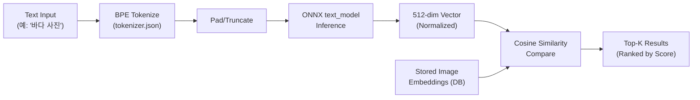
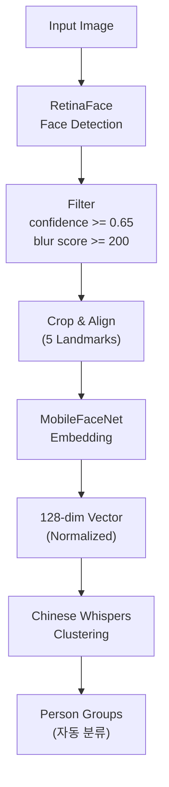
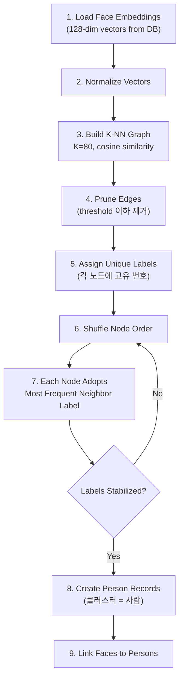

# AI/ML Features

## AI가 이 앱에서 뭘 하나?

Lap은 사진 관리 앱인데, AI가 세 가지 핵심 역할을 합니다:

1. **사진 검색** (CLIP): "바다 사진"이라고 텍스트로 검색하면 바다가 담긴 사진을 찾아줍니다
2. **얼굴 인식** (RetinaFace + MobileFaceNet): 사진 속 얼굴을 찾고, 같은 사람끼리 자동으로 묶어줍니다
3. **스마트 태그** (CLIP): 사진 내용을 보고 "풍경", "음식", "인물" 등의 태그를 자동으로 붙여줍니다

이 모든 AI 처리가 **내 컴퓨터에서만** 돌아갑니다. 클라우드 서버로 사진을 보내지 않습니다.

### 왜 클라우드 안 쓰고 로컬에서 돌리나?

| 이유 | 설명 |
|------|------|
| **프라이버시** | 내 사진이 절대 외부 서버로 전송되지 않음. 가족 사진, 개인 사진 등 민감한 데이터가 안전 |
| **오프라인 사용** | 인터넷 없이도 모든 AI 기능 사용 가능. 비행기 안에서도, 산속에서도 OK |
| **구독료 없음** | Google Photos나 iCloud처럼 월정액을 낼 필요 없음. 한번 설치하면 영구 무료 |
| **속도** | 네트워크 왕복 없이 바로 처리. M시리즈 Mac에서 이미지 한 장당 약 100ms |

All inference runs locally via ONNX Runtime. No cloud services, no data leaves the device.

## Models

| Model | File | Size | Purpose |
|-------|------|------|---------|
| RetinaFace | `det_500m.onnx` | ~0.5M params | Face detection |
| MobileFaceNet | `w600k_mbf.onnx` | ~600K params | Face embedding (128-dim) |
| CLIP Vision | `vision_model.onnx` | - | Image → 512-dim vector |
| CLIP Text | `text_model.onnx` | - | Text → 512-dim vector |
| Tokenizer | `tokenizer.json` | - | BPE tokenization for CLIP |

Located in `src-tauri/resources/models/`. Downloaded via `scripts/download_models.sh`.

## CLIP Image Search (`t_ai.rs`, 219 lines)

### How It Works

> **비유: 도서관에서 책을 찾는 것과 같습니다.**
> 사서에게 "바다 사진"이라고 말하면, 사서가 모든 사진을 머릿속에서 떠올리고 바다와 가장 비슷한 것부터 가져다줍니다.
> CLIP이 바로 이 "만능 사서" 역할을 합니다. 텍스트와 이미지를 같은 언어로 이해할 수 있는 AI입니다.

CLIP encodes images and text into the same 512-dimensional vector space. Similar concepts have similar vectors.

### Text Encoding
```
Input text
  → BPE tokenize (tokenizer.json)
  → Pad/truncate to fixed length
  → ONNX text_model inference
  → 512-dim normalized vector
```

### Image Encoding
```
Input image
  → Resize to 224x224
  → Normalize: mean=[0.48145466, 0.4578275, 0.40821073]
               std=[0.26862954, 0.26130258, 0.27577711]
  → ONNX vision_model inference
  → 512-dim normalized vector
```

### Search
```
User query text → text embedding (512-dim)
Compare against all stored image embeddings via cosine similarity
Return top-K results ranked by similarity score
```

### CLIP Search Pipeline (전체 흐름)



### "512-dim vector"가 뭔가요?

> **사진의 DNA라고 생각하면 됩니다.** 512개의 숫자로 사진의 특징을 요약한 것입니다.
> 예를 들어 바다 사진은 `[0.82, -0.15, 0.43, ...]` 같은 512개 숫자가 되고,
> 다른 바다 사진도 비슷한 숫자 패턴을 가집니다.
> 비슷한 사진은 비슷한 DNA를 가지므로, 두 벡터를 비교하면 사진이 얼마나 비슷한지 알 수 있습니다.
>
> 이 비교 방법을 **cosine similarity**(코사인 유사도)라고 합니다. 두 벡터의 방향이 비슷하면 1에 가깝고, 전혀 다르면 0에 가깝습니다.

### Embedding Storage
- Stored as BLOB in `afiles.embedding` column (f32 array → bytes)
- Generated during album indexing or on-demand

## Face Recognition (`t_face.rs`, 883 lines)

> **InsightFace vs RetinaFace vs MobileFaceNet?**
> README에는 "InsightFace"라고 적혀있고, 여기서는 RetinaFace/MobileFaceNet이라고 합니다. [InsightFace](https://github.com/deepinsight/insightface)는 얼굴 인식 모델들을 모아놓은 **프로젝트 이름**이고, RetinaFace(검출)와 MobileFaceNet(임베딩)은 그 안의 **개별 모델**입니다. Lap은 InsightFace 프로젝트에서 이 두 모델을 ONNX로 변환해서 사용합니다.

> **비유: 경찰이 범인을 찾는 과정과 비슷합니다.**
> 1. **CCTV에서 얼굴 찾기** (RetinaFace) - 사진 속에서 "여기 얼굴이 있다!"를 감지
> 2. **얼굴 특징 기록** (MobileFaceNet) - 찾은 얼굴의 고유한 특징(눈 간격, 코 모양 등)을 128개 숫자로 기록
> 3. **같은 사람끼리 묶기** (Chinese Whispers) - 특징이 비슷한 얼굴들을 같은 사람으로 분류

### Detection Pipeline (RetinaFace)

```
Input image
  → Letterbox resize to ≤640px (round to 32px boundary)
  → Normalize: (pixel - 127.5) / 128.0
  → ONNX det_500m inference (multi-scale: strides 8, 16, 32)
  → Decode anchors (stride-aware box decoding)
  → Scale back to original dimensions
  → NMS (Non-Maximum Suppression, IOU threshold: 0.4)
  → Filter: confidence ≥ 0.65, blur score ≥ 200.0
  → Output: list of FaceBox (bbox + 5 landmarks)
```

### Embedding (MobileFaceNet)

```
Detected face region
  → Crop and align using 5 landmarks
  → Resize to model input
  → ONNX w600k_mbf inference
  → 128-dim normalized vector
  → Store in faces.embedding as BLOB
```

### Face Recognition Pipeline (전체 흐름)



### Key Constants
```rust
MIN_CONFIDENCE: f32 = 0.65;     // Detection threshold
MIN_BLUR_SCORE: f32 = 200.0;    // Laplacian variance (reject blurry faces)
NMS_IOU_THRESHOLD: f32 = 0.4;   // Overlap suppression
```

### Data Structures
```rust
struct FaceBox {
    x1: f32, y1: f32, x2: f32, y2: f32,  // Bounding box
    confidence: f32,
    landmarks: [(f32, f32); 5],            // Left eye, right eye, nose, mouth L/R
}

struct FaceData {
    face_box: FaceBox,
    embedding: Vec<f32>,  // 128-dim
}
```

## Face Clustering (`t_cluster.rs`, 282 lines)

### Algorithm: Chinese Whispers

> **"전화기 게임"(Chinese Whispers)을 아시나요?**
> 한 줄로 서서 옆 사람에게 귓속말을 전달하는 게임입니다.
> 이 알고리즘도 비슷합니다:
> - 각 얼굴(노드)이 처음에 고유한 라벨(번호)을 받습니다
> - 각 노드가 가장 비슷한 이웃들의 라벨을 살펴보고, 가장 많은 라벨을 자기 것으로 채택합니다
> - 이 과정을 반복하면, 밀접한 그룹(같은 사람의 얼굴)끼리 같은 라벨로 수렴합니다
> - 결과적으로 "이 얼굴들은 같은 사람"이라는 클러스터가 자동으로 형성됩니다
>
> 장점: 사람이 몇 명인지 미리 알려줄 필요가 없습니다. 알고리즘이 알아서 파악합니다.

Graph-based clustering that doesn't require knowing the number of clusters in advance.

```
1. Load all face embeddings from database
2. Normalize each 128-dim vector
3. Build K-NN graph:
   - For each face, find top-K most similar faces
   - K = 80
   - Similarity = cosine similarity (dot product of normalized vectors)
   - Prune edges below user-configured threshold
4. Chinese Whispers iteration:
   - Assign each node a unique label
   - Shuffle node order
   - For each node: adopt the most frequent label among neighbors
   - Repeat until convergence (labels stabilize)
5. Create Person records for each cluster
6. Link faces to their Person
```

### Chinese Whispers Algorithm (단계별 흐름)



### Key Constants
```rust
K_NEIGHBORS: usize = 80;   // Max edges per node
MIN_SAMPLES: usize = 1;    // Single face can be a cluster
```

### Similarity Thresholds (User-configurable)
- Stricter threshold → more clusters, higher precision
- Looser threshold → fewer clusters, more faces per person

## Smart Tags

AI-generated tags based on CLIP image classification. Defined in `src-vite/src/common/smartTags.ts`.

Uses CLIP vision embeddings compared against predefined text labels (e.g., "outdoor", "food", "portrait", "landscape").

## Performance Notes

- **Face indexing**: CPU-bound, runs in separate thread with progress events
- **CLIP encoding**: ~100ms per image on M-series Mac
- **Clustering**: O(n * K) per iteration, fast for typical library sizes
- **Embedding storage**: 512 floats * 4 bytes = 2KB per image (CLIP), 128 * 4 = 512 bytes per face
- **Cancellation**: AtomicBool flags for graceful abort
