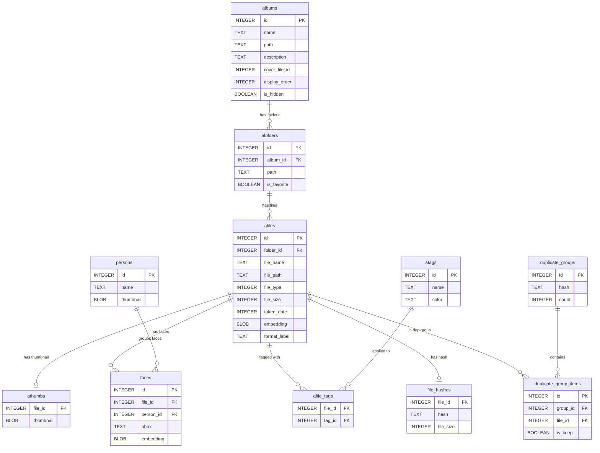

# Database Schema

## 데이터베이스가 뭔가요?

> **Excel 파일 하나에 여러 시트(Sheet)가 있는 것과 비슷합니다.**
> - Excel 파일 = SQLite 데이터베이스 파일 (`.db` 확장자 하나)
> - 각 시트 = 테이블 (albums, afiles, faces 등)
> - 각 시트의 열(column) = 테이블의 컬럼 (name, path, file_size 등)
> - 각 시트의 행(row) = 하나의 레코드 (사진 한 장, 앨범 하나 등)
>
> SQLite는 서버가 필요 없는 가벼운 데이터베이스입니다.
> MySQL이나 PostgreSQL처럼 별도 프로그램을 설치할 필요 없이, 파일 하나로 모든 데이터를 관리합니다.
> 모바일 앱이나 데스크톱 앱에서 가장 많이 쓰이는 데이터베이스입니다.

SQLite database managed via `t_sqlite.rs` (3,744 lines) with migrations in `t_migration.rs`.

## 테이블 간 관계

아래 다이어그램은 주요 테이블들이 어떻게 연결되는지 보여줍니다.

> **비유: 파일 탐색기의 폴더 구조와 비슷합니다.**
> 앨범(albums) 안에 폴더(afolders)가 있고, 폴더 안에 파일(afiles)이 있고,
> 각 파일에 썸네일(athumbs)과 얼굴(faces)이 연결됩니다.

```
albums (앨범)
  │
  ├──< afolders (하위 폴더)
  │       │
  │       ├──< afiles (개별 파일: 사진/동영상)
  │       │       │
  │       │       ├──── athumbs (썸네일 이미지, 1:1)
  │       │       ├──── faces (감지된 얼굴들, 1:N)
  │       │       ├──<> afile_tags (태그 연결, M:N)
  │       │       ├──── file_hashes (파일 해시, 1:1)
  │       │       └──── duplicate_group_items (중복 그룹 항목)
  │       │
  │       └── ...
  └── ...

persons (사람) ←── faces (얼굴이 사람에 연결)
atags (태그) ←──<> afile_tags (태그와 파일의 다대다 관계)
duplicate_groups (중복 그룹) ←── duplicate_group_items
```

**관계 기호 설명:**
- `──<` : 1:N (하나에 여러 개), 예: 앨범 하나에 폴더 여러 개
- `──<>` : M:N (다대다), 예: 파일 하나에 태그 여러 개, 태그 하나에 파일 여러 개
- `────` : 1:1 (하나에 하나), 예: 파일 하나에 썸네일 하나

### ER Diagram



## Tables

### `albums`
Photo collections (top-level folders added by user).

| Column | Type | Description |
|--------|------|-------------|
| id | INTEGER PK | Auto-increment |
| name | TEXT | Album display name |
| path | TEXT | Absolute folder path |
| description | TEXT | Optional description |
| cover_file_id | INTEGER | Thumbnail cover file |
| display_order | INTEGER | Sort order |
| total_count | INTEGER | Total files |
| indexed_count | INTEGER | Indexed files |
| is_hidden | BOOLEAN | Hidden from sidebar |

### `afolders`
Sub-folders within albums.

| Column | Type | Description |
|--------|------|-------------|
| id | INTEGER PK | Auto-increment |
| album_id | INTEGER FK | Parent album |
| path | TEXT | Absolute folder path |
| is_favorite | BOOLEAN | Starred folder |

### `afiles`
Individual media files with metadata.

| Column | Type | Description |
|--------|------|-------------|
| id | INTEGER PK | Auto-increment |
| folder_id | INTEGER FK | Parent folder |
| file_name | TEXT | File name |
| file_path | TEXT | Absolute path |
| file_type | INTEGER | 비트마스크: 1=이미지, 2=동영상 (아래 설명 참고) |
| file_size | INTEGER | Bytes |
| width | INTEGER | Pixel width |
| height | INTEGER | Pixel height |
| create_time | INTEGER | Unix timestamp |
| modify_time | INTEGER | Unix timestamp |
| taken_date | INTEGER | EXIF date taken (Unix) |
| camera_make | TEXT | EXIF camera make |
| camera_model | TEXT | EXIF camera model |
| lens_model | TEXT | EXIF lens model |
| focal_length | REAL | EXIF focal length (mm) |
| exposure_time | TEXT | EXIF exposure |
| f_number | REAL | EXIF aperture |
| iso | INTEGER | EXIF ISO |
| latitude | REAL | GPS latitude |
| longitude | REAL | GPS longitude |
| rotation | INTEGER | Applied rotation (0/90/180/270) |
| is_favorite | BOOLEAN | Favorited |
| rating | INTEGER | 1-5 stars |
| comment | TEXT | User comment |
| embedding | BLOB | CLIP 512-dim 벡터 (아래 BLOB/embedding 설명 참고) |
| format_label | TEXT | Format display label (added in migration v2) |

#### file_type 숫자의 의미

`file_type`은 **비트마스크(bitmask)** 방식으로 파일 종류를 구분합니다:

| 값 | 이진수 | 의미 |
|----|--------|------|
| 1 | `01` | 일반 이미지 (JPEG, PNG, RAW 등) |
| 2 | `10` | 동영상 (MP4, MOV 등) |

비트마스크란? 각 비트(자릿수)가 하나의 속성을 나타내는 방식입니다. SQL에서 `file_type & 1 != 0`으로 이미지만 필터링하고, `file_type & 2 != 0`으로 동영상만 필터링할 수 있습니다. `file_type & 3 != 0`이면 둘 다 포함합니다.

#### BLOB이 뭔가요?

**BLOB = Binary Large OBject** (바이너리 큰 덩어리)

일반 텍스트 컬럼은 "hello" 같은 글자를 저장하지만, BLOB은 이미지 데이터나 숫자 배열 같은 **원본 바이트를 그대로** 저장합니다. 이 프로젝트에서 BLOB이 쓰이는 곳:

- `athumbs.thumbnail`: JPEG 썸네일 이미지의 바이트 데이터
- `afiles.embedding`: CLIP 벡터 (512개 float 숫자)
- `faces.embedding`: 얼굴 벡터 (128개 float 숫자)
- `persons.thumbnail`: 대표 얼굴 썸네일 이미지

#### embedding 컬럼은 어떻게 저장되나요?

> 512개의 소수점 숫자(float32)를 바이트로 변환해서 BLOB에 저장합니다.
> - float32 하나 = 4 bytes
> - 512개 float32 = 512 x 4 = **2,048 bytes (약 2KB)** per image
> - 나중에 검색할 때 바이트를 다시 float 배열로 변환해서 cosine similarity를 계산합니다

### `athumbs`
Cached thumbnails.

| Column | Type | Description |
|--------|------|-------------|
| file_id | INTEGER FK | Reference to afiles |
| thumbnail | BLOB | JPEG thumbnail data |

### `atags`
User-defined tags.

| Column | Type | Description |
|--------|------|-------------|
| id | INTEGER PK | Auto-increment |
| name | TEXT | Tag name |
| color | TEXT | Display color |

### `afile_tags`
Many-to-many: files ↔ tags.

| Column | Type | Description |
|--------|------|-------------|
| file_id | INTEGER FK | Reference to afiles |
| tag_id | INTEGER FK | Reference to atags |

### `persons`
Face clustering results.

| Column | Type | Description |
|--------|------|-------------|
| id | INTEGER PK | Person cluster ID |
| name | TEXT | Person name (user-assigned) |
| thumbnail | BLOB | Representative face thumbnail |

### `faces`
Individual face detections.

| Column | Type | Description |
|--------|------|-------------|
| id | INTEGER PK | Auto-increment |
| file_id | INTEGER FK | Source image |
| person_id | INTEGER FK | Assigned person cluster |
| bbox | TEXT | JSON bounding box |
| embedding | BLOB | 128-dim MobileFaceNet vector |

### `file_hashes` (migration v1)
Content hashes for deduplication.

| Column | Type | Description |
|--------|------|-------------|
| file_id | INTEGER FK | Reference to afiles |
| hash | TEXT | SHA-256 content hash |
| file_size | INTEGER | File size in bytes |

### `duplicate_groups` (migration v1)
Groups of identical files.

| Column | Type | Description |
|--------|------|-------------|
| id | INTEGER PK | Group ID |
| hash | TEXT | Shared content hash |
| file_size | INTEGER | Shared file size |
| count | INTEGER | Number of duplicates |

### `duplicate_group_items` (migration v1)
Files within duplicate groups.

| Column | Type | Description |
|--------|------|-------------|
| id | INTEGER PK | Auto-increment |
| group_id | INTEGER FK | Duplicate group |
| file_id | INTEGER FK | File in group |
| is_keep | BOOLEAN | User marked to keep |

## Migrations (`t_migration.rs`)

### Migration이 뭔가요?

> **앱 업데이트 시 기존 데이터베이스에 새 컬럼이나 테이블을 추가하는 작업입니다.**
>
> 비유: Excel 파일에 새 열(column)을 추가하는 것과 같습니다. 기존 데이터는 그대로 두고, 새로운 기능에 필요한 열만 추가합니다.
>
> 예를 들어 v2 migration은 `afiles` 테이블에 `format_label` 컬럼을 추가했습니다.
> 이미 저장된 사진 데이터는 그대로이고, 새 컬럼만 빈 값으로 추가됩니다.
>
> `PRAGMA user_version`은 현재 DB가 몇 번째 버전인지 기록하는 SQLite 내장 기능입니다.
> 앱이 시작될 때 이 값을 확인하고, 아직 적용되지 않은 migration만 순서대로 실행합니다.

Schema versioned via `PRAGMA user_version`.

| Version | Changes |
|---------|---------|
| v1 | Create `file_hashes`, `duplicate_groups`, `duplicate_group_items` tables |
| v2 | Add `format_label` column to `afiles` |

## Connection Pattern

```rust
// No connection pool — open per query
fn open_conn(db_path: &str) -> Result<Connection, String> {
    Connection::open(db_path).map_err(|e| e.to_string())
}
```

## Query Patterns

### Filtered file query
```sql
SELECT * FROM afiles
WHERE folder_id IN (SELECT id FROM afolders WHERE album_id = ?)
  AND file_type & ? != 0        -- bitmask filter
  AND taken_date BETWEEN ? AND ? -- date range
  AND is_favorite = ?
ORDER BY taken_date DESC
LIMIT ? OFFSET ?
```

### Cosine similarity search
```rust
// Load all embeddings, compute dot product in Rust
// (not SQL-based — vectors stored as BLOBs)
let similarity = dot_product(&query_vec, &stored_vec);
```

## Database Location

Stored in Tauri app data directory:
- macOS: `~/Library/Application Support/com.julyx10.lap/`
- Windows: `%APPDATA%/com.julyx10.lap/`
- Linux: `~/.local/share/com.julyx10.lap/`

Each library has its own SQLite file.

### 왜 각 라이브러리마다 별도 DB 파일인가요?

Lap은 여러 개의 사진 라이브러리를 만들 수 있습니다 (예: "가족 사진", "여행 사진", "업무용"). 각 라이브러리가 독립된 SQLite 파일을 가지는 이유:

1. **격리**: 한 라이브러리의 DB가 손상되어도 다른 라이브러리에 영향 없음
2. **이동성**: 라이브러리 하나를 통째로 백업하거나 다른 컴퓨터로 옮기기 쉬움
3. **성능**: 각 DB 파일 크기가 작아져서 쿼리가 빠름
4. **단순함**: 모든 쿼리에서 "어떤 라이브러리의 데이터인지" 필터링할 필요 없음
