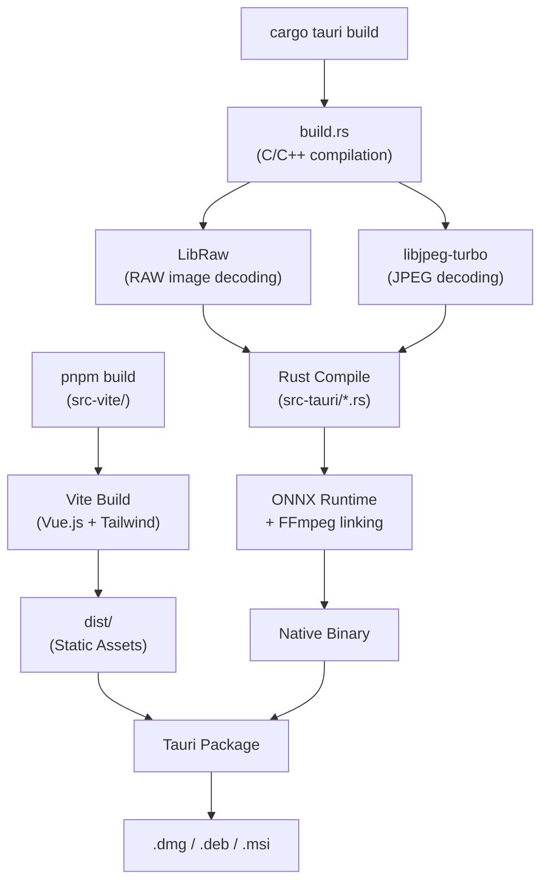
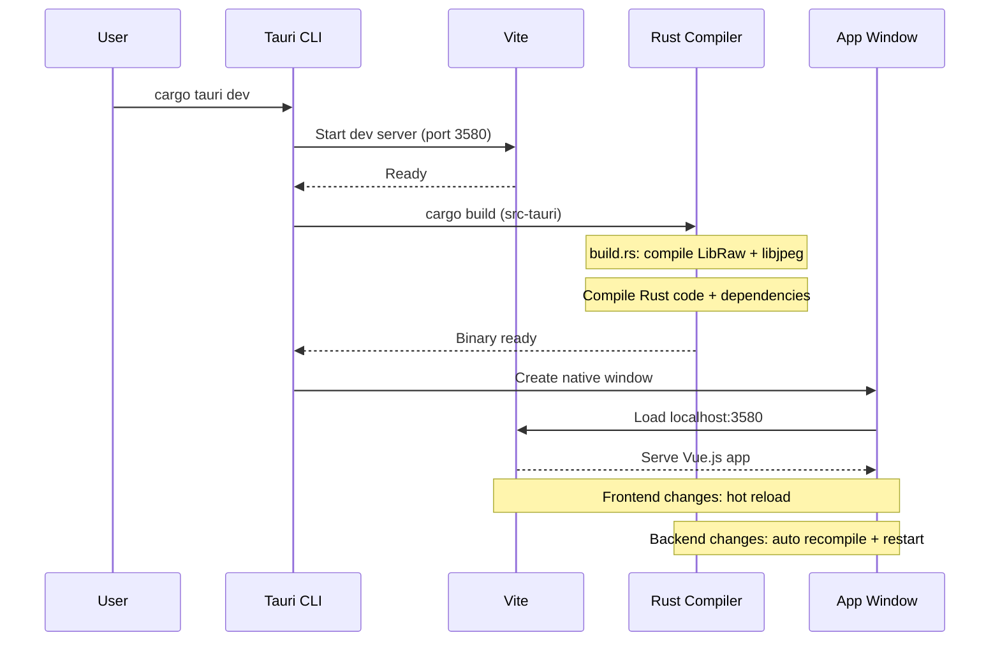

# Build & Development

## 왜 이렇게 설치할 게 많나요?

> Lap은 **하이브리드 앱**입니다. 웹 기술(HTML/CSS/JS)로 화면을 그리고, Rust로 무거운 처리(AI, 이미지 처리, DB)를 합니다.
> 거기에 C/C++ 라이브러리(LibRaw, libjpeg-turbo, FFmpeg)까지 직접 컴파일해서 포함합니다.
>
> 마치 집을 지을 때 목수(Rust), 전기 기사(Node.js), 배관공(cmake/C++)이 모두 필요한 것처럼,
> 각각의 기술 영역마다 해당 도구가 필요합니다.
>
> 한번만 설치하면 되니 처음이 가장 어렵습니다. 이후에는 `cargo tauri dev` 한 줄로 개발할 수 있습니다.

## Prerequisites

| Tool | Version | Purpose | 쉬운 설명 |
|------|---------|---------|-----------|
| Node.js | 20+ | Frontend build | Vue.js 프론트엔드를 빌드하는 JavaScript 런타임. 브라우저 밖에서 JS를 실행 |
| pnpm | latest | Package manager | npm보다 빠르고 디스크를 적게 쓰는 패키지 관리자 |
| Rust | stable | Backend build | 백엔드(AI, DB, 이미지 처리)를 컴파일하는 언어/도구체인 |
| cmake | latest | libjpeg-turbo compilation | C/C++ 라이브러리(LibRaw, libjpeg-turbo)를 빌드하는 도구. 이미지 디코딩에 필요 |
| nasm | latest | SIMD optimization | 어셈블리 컴파일러. libjpeg-turbo와 FFmpeg가 CPU의 SIMD 명령어로 고속 처리할 때 필요 |

### macOS
```bash
xcode-select --install
brew install nasm pkg-config autoconf automake libtool cmake
```

### Linux (Ubuntu/Debian)
```bash
sudo apt install libwebkit2gtk-4.1-dev libappindicator3-dev librsvg2-dev \
  patchelf nasm clang pkg-config autoconf automake libtool cmake
```

## First-Time Setup

```bash
# Clone with submodules
git clone --recursive https://github.com/julyx10/lap.git
cd lap

# If cloned without --recursive
git submodule update --init --recursive

# Install Tauri CLI
cargo install tauri-cli --version "^2.0.0" --locked

# Download AI models
./scripts/download_models.sh          # macOS/Linux
# .\scripts\download_models.ps1      # Windows

# Install frontend dependencies
cd src-vite && pnpm install && cd ..

# Start development
cargo tauri dev
```

Dev server runs at `localhost:3580` (proxied by Tauri).

### `cargo tauri dev` 하면 내부에서 무슨 일이 일어나나?

`cargo tauri dev`를 실행하면 아래 과정이 **자동으로** 진행됩니다:

```
1. [~5초]   Vite 개발 서버 시작 (localhost:3580)
   └── Vue.js 프론트엔드를 실시간으로 빌드하고 핫 리로드 제공

2. [~30초~2분] Rust 백엔드 컴파일 (첫 빌드 시 오래 걸림)
   ├── build.rs 실행 → LibRaw, libjpeg-turbo C 라이브러리 컴파일
   ├── Cargo 의존성 컴파일 (onnxruntime, ffmpeg 등)
   └── src-tauri/*.rs 컴파일 → 실행 파일 생성

3. [~1초]   Tauri 네이티브 윈도우 생성
   └── WebView에 localhost:3580 로드 → 앱 화면 표시
```

**첫 빌드**는 모든 의존성을 컴파일하므로 5~10분 걸릴 수 있습니다.
**이후 빌드**는 변경된 부분만 다시 컴파일하므로 수 초~수십 초면 됩니다.
프론트엔드(Vue) 변경은 핫 리로드로 즉시 반영되고, 백엔드(Rust) 변경은 자동 재컴파일됩니다.

### Build Pipeline (전체 빌드 과정)



### `cargo tauri dev` Sequence



## Build Commands

| Command | Purpose |
|---------|---------|
| `cargo tauri dev` | Development with hot reload |
| `cargo tauri build` | Production build |
| `cd src-vite && pnpm dev` | Frontend only (no Tauri) |
| `cd src-vite && pnpm build` | Frontend production build |

## CI/CD Workflows

### `release.yml`
- **Trigger**: Git tags matching `v*` or manual dispatch
- **Builds**: macOS (aarch64 + x64), Linux (x64)
- **Steps**: deps → models → pnpm build → cargo tauri build → sign/notarize → release
- **Artifacts**: .dmg (macOS), .deb (Linux)

### `release-windows.yml`
- **Trigger**: Same as release.yml
- **Builds**: Windows x64
- **Artifacts**: .msi installer

### `pr-build.yml`
- **Trigger**: Pull requests (opened, synchronize, reopened)
- **Builds**: macOS + Linux
- **Caches**: pnpm, Rust dependencies
- **Uploads**: Build artifacts for testing

### `deploy-docs.yml`
- **Trigger**: Push to main
- **Deploys**: VitePress docs to GitHub Pages

## Project Structure for Build

```
src-tauri/
├── Cargo.toml              # Rust dependencies
├── build.rs                # Compiles LibRaw + libjpeg-turbo
├── tauri.conf.json         # Main Tauri config
├── tauri.macos.conf.json   # macOS overrides
├── tauri.windows.conf.json # Windows overrides
├── third_party/
│   ├── LibRaw/             # Git submodule
│   └── libjpeg-turbo/      # Git submodule
└── resources/models/       # ONNX models (downloaded)

src-vite/
├── package.json            # Node dependencies
├── vite.config.js          # Vite config (port 3580)
├── tailwind.config.js      # Tailwind + daisyUI
└── dist/                   # Build output
```

## Release Profile

```toml
[profile.release]
codegen-units = 1    # Single codegen unit (slower build, faster binary)
lto = true           # Link-time optimization
strip = true         # Strip debug symbols
```

## Troubleshooting

### Submodules not initialized
```bash
git submodule update --init --recursive
```

### Missing cmake
```bash
brew install cmake   # macOS
sudo apt install cmake  # Linux
```

### ort-sys linker error after macOS CLT update
If clang version changed (e.g., 17 → 21):
```bash
rm -rf target/debug/build/ort-sys-*
rm -rf ~/Library/Caches/ort.pyke.io
cargo tauri dev  # Rebuild
```

### FFmpeg build issues
FFmpeg uses static linking on Unix (`features = ["static", "build"]`), dynamic on Windows.
Ensure `nasm` and `pkg-config` are installed.

#### 정적(static) vs 동적(dynamic) 링킹이 뭔가요?

> - **정적 링킹**: 라이브러리 코드를 앱 실행 파일 안에 통째로 포함시킵니다. 앱 파일 크기는 커지지만, 사용자가 따로 라이브러리를 설치할 필요가 없습니다.
> - **동적 링킹**: 앱이 실행될 때 시스템에 설치된 라이브러리를 찾아서 사용합니다. 앱 크기는 작지만, 해당 라이브러리가 미리 설치되어 있어야 합니다.
>
> Lap은 Unix(macOS/Linux)에서 FFmpeg을 **정적 링킹**합니다.
> 사용자가 별도로 FFmpeg을 설치하지 않아도 앱이 바로 동작하기 위해서입니다.
> Windows에서는 **동적 링킹**을 사용합니다.

### 처음 빌드할 때 자주 겪는 문제들

| 증상 | 원인 | 해결 |
|------|------|------|
| `cmake: command not found` | cmake 미설치 | `brew install cmake` (macOS) / `sudo apt install cmake` (Linux) |
| `nasm: command not found` | nasm 미설치 | `brew install nasm` (macOS) / `sudo apt install nasm` (Linux) |
| `error: linker cc not found` | C 컴파일러 미설치 | `xcode-select --install` (macOS) / `sudo apt install build-essential` (Linux) |
| `pnpm: command not found` | pnpm 미설치 | `npm install -g pnpm` |
| `git submodule` 관련 에러 | 서브모듈 미초기화 | `git submodule update --init --recursive` |
| ONNX 모델 파일 없음 | 모델 다운로드 안 함 | `./scripts/download_models.sh` 실행 |
| Rust 컴파일 매우 느림 | 첫 빌드 시 정상 | 의존성이 많아서 첫 빌드는 5~10분 소요. 이후에는 빨라짐 |
| `tauri-cli` 관련 에러 | Tauri CLI 미설치 | `cargo install tauri-cli --version "^2.0.0" --locked` |
