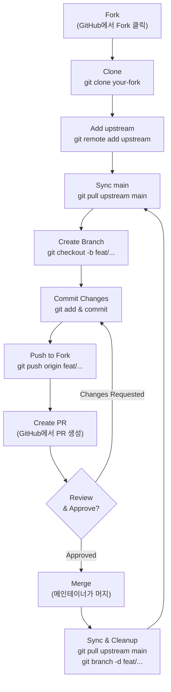

# Contributing Guide

## 오픈소스 기여가 처음이라면

오픈소스 기여는 생각보다 간단합니다. 핵심은 이것입니다:

1. 원본 저장소를 복사(Fork)해서 내 계정에 사본을 만든다
2. 사본에서 마음대로 수정한다
3. "이거 좋으면 반영해주세요"라고 요청(Pull Request)을 보낸다
4. 메인테이너가 검토하고 반영(Merge)한다

처음에는 작은 것부터 시작하세요. 오타 수정, 번역 추가, 문서 개선 등도 훌륭한 기여입니다.

## Git Workflow (Fork-based)

```
julyx10/lap (upstream)  ←  PR goes here
       ↕ fetch/pull
  Your local repo
       ↕ push/pull
your-username/lap (origin)  ←  Your fork
```

> **비유: 도서관에서 책을 빌려와 필기하는 것과 비슷합니다.**
>
> - **upstream** (julyx10/lap) = 도서관의 원본 책. 직접 수정할 수 없음
> - **origin** (your-username/lap) = 내가 복사해온 내 사본. 마음대로 수정 가능
> - **local repo** = 내 컴퓨터에 다운받은 작업 공간. 여기서 실제 코딩
>
> 작업 흐름: 원본(upstream)에서 최신 내용을 받아오고 → 내 컴퓨터(local)에서 수정하고 → 내 사본(origin)에 올리고 → 원본에 "반영해주세요" 요청(PR)

### Git Workflow Flowchart



### Setup
```bash
git remote add upstream https://github.com/julyx10/lap.git
```

### Contributing Flow
```bash
# 1. Sync with upstream
git checkout main
git pull upstream main

# 2. Create feature branch
git checkout -b feat/your-feature

# 3. Make changes, commit
git add <files>
git commit -m "feat: description"

# 4. Push to your fork
git push origin feat/your-feature

# 5. Create PR on GitHub
#    your-username/lap:feat/your-feature → julyx10/lap:main

# 6. After merge, cleanup
git checkout main
git pull upstream main
git push origin main
git branch -d feat/your-feature
```

### PR이 머지된 후 해야 할 것 (체크리스트)

- [ ] `main` 브랜치로 이동: `git checkout main`
- [ ] upstream에서 최신 코드 받기: `git pull upstream main`
- [ ] 내 fork의 main도 업데이트: `git push origin main`
- [ ] 작업했던 feature 브랜치 삭제 (로컬): `git branch -d feat/your-feature`
- [ ] 작업했던 feature 브랜치 삭제 (원격): `git push origin --delete feat/your-feature`
- [ ] GitHub에서 PR이 정상적으로 머지되었는지 확인

## Code Organization

### Backend (Rust)
- One module per file: `t_<name>.rs`
- Commands in `t_cmds.rs` with `#[tauri::command]`
- Register new commands in `main.rs` invoke_handler
- Database queries in `t_sqlite.rs`

### Frontend (Vue)
- Components in `src/components/`
- Pages in `src/views/`
- Backend API wrappers in `src/common/api.js`
- State in `src/stores/`
- i18n strings in `src/locales/*.json`

## Adding a New Feature

### Backend
1. Add `#[tauri::command]` function in `t_cmds.rs`
2. Register in `main.rs` `generate_handler![]`
3. Add database support in `t_sqlite.rs` if needed
4. Add new table? Create migration in `t_migration.rs`

### Frontend
1. Add API wrapper in `common/api.js`
2. Create/modify component in `components/`
3. Update store if state needed
4. Add i18n strings to all 9 locale files
5. Style with Tailwind + daisyUI (no scoped CSS)

### Both
1. Backend command + frontend invoke must match:
   ```rust
   // Rust
   #[tauri::command]
   fn my_command(param: String) -> Result<String, String> { ... }
   ```
   ```javascript
   // JavaScript
   await invoke('my_command', { param: 'value' });
   ```

## Commit Message Format

```
<type>: <description>
```

Types: `feat`, `fix`, `refactor`, `docs`, `test`, `chore`, `perf`, `ci`

### 각 타입의 의미와 예시

| 타입 | 의미 | 한국어 설명 | 예시 |
|------|------|-------------|------|
| `feat` | Feature | 새로운 기능 추가 | `feat: Add clock icon to display taken_date in content view` |
| `fix` | Bug fix | 버그 수정 | `fix: release workflow – use native runners, fix matrix format` |
| `docs` | Documentation | 문서 수정 | `docs: Update README with detailed platform support` |
| `refactor` | Refactoring | 기능 변경 없이 코드 구조 개선 | `refactor: extract thumbnail logic into separate module` |
| `test` | Test | 테스트 추가/수정 | `test: add unit tests for face clustering` |
| `chore` | Chore | 빌드, 설정 등 잡일 | `chore: release v0.1.12` |
| `perf` | Performance | 성능 개선 | `perf: optimize CLIP embedding batch processing` |
| `ci` | CI/CD | CI/CD 파이프라인 수정 | `ci: add Linux arm64 build target` |

**팁**: 커밋 메시지는 영어로 작성하는 것이 관례입니다. "Add", "Fix", "Update" 등 동사로 시작하세요.

## Common Patterns

### Error Handling (Rust)
```rust
// Simple string errors throughout
fn my_function() -> Result<T, String> {
    something().map_err(|e| e.to_string())?;
    Ok(result)
}
```

### State Access (Rust)
```rust
#[tauri::command]
fn my_command(state: State<'_, Mutex<MyEngine>>) -> Result<(), String> {
    let engine = state.lock().map_err(|e| e.to_string())?;
    // use engine
    Ok(())
}
```

### API Call (Frontend)
```javascript
export async function myFunction(param) {
  return await invoke('my_command', { param });
}
```

### Progress Events
```rust
// Backend: emit progress
app_handle.emit("my-progress", payload)?;
```
```javascript
// Frontend: listen
listen('my-progress', (event) => {
  updateProgress(event.payload);
});
```

## Gotchas

### EXIF parsing
- Wrapped in panic handlers — some files have malformed EXIF
- Always handle `None` / error cases

### RAW dimensions
- LibRaw may fail; fallback to EXIF metadata
- Test with multiple RAW formats (CR2, NEF, ARW, DNG)

### Video rotation
- Modern MOV/MP4 use display-matrix side data, not legacy `rotate` tag
- FFmpeg wrapper handles both

### Face embedding normalization
- Embeddings MUST be normalized before cosine distance
- `cosine_distance = 1.0 - dot_product(a, b)` (assumes normalized)

### Tauri permissions
- Sandbox requires explicit folder access via scope requests
- `restore_album_scopes()` re-establishes permissions on startup

### Large components
- `Content.vue` is 159K — be careful with changes
- `t_sqlite.rs` is 3,744 lines — largest backend module

### No test framework
- No automated tests in the repo currently
- Test manually with real photo libraries
- Consider adding tests if contributing significant features

## 좋은 첫 번째 기여 아이디어

처음 기여할 때는 작고 명확한 작업부터 시작하는 것이 좋습니다:

| 난이도 | 작업 | 설명 |
|--------|------|------|
| 쉬움 | **i18n 번역 추가/수정** | `src-vite/src/locales/*.json` 파일에서 번역 누락이나 오타 수정. 한국어(`ko.json`) 개선도 환영 |
| 쉬움 | **문서 개선** | wiki 문서나 README의 오타 수정, 설명 보강 |
| 쉬움 | **UI 텍스트 개선** | 버튼 라벨, 툴팁, 에러 메시지를 더 명확하게 수정 |
| 보통 | **작은 UI 개선** | 아이콘 추가, 간격 조정, 다크모드 색상 수정 등 Tailwind/daisyUI 수정 |
| 보통 | **새로운 Smart Tag 추가** | `smartTags.ts`에 CLIP 텍스트 라벨 추가 (예: "sunset", "pet" 등) |
| 보통 | **버그 리포트** | 앱을 사용하면서 발견한 버그를 GitHub Issue로 상세히 보고 |

## Feature → Code Map

| Feature | Backend | Frontend |
|---------|---------|----------|
| Browse photos | `t_sqlite`, `t_cmds` | `Content.vue`, `GridView.vue`, `Thumbnail.vue` |
| Multiple libraries | `t_config` | `configStore`, `Library.vue` |
| Duplicate detection | `t_dedup` | `DedupPane.vue` |
| Image editing | `t_image` | `EditImage.vue` |
| RAW photos | `t_libraw`, `t_image` | `Image.vue`, `MediaViewer.vue` |
| Face recognition | `t_face`, `t_cluster` | `Person.vue` |
| AI search | `t_ai` (CLIP) | `ImageSearch.vue` |
| Map view | `t_sqlite` (geo) | `Location.vue`, `MapView.vue` |
| Video support | `t_video` (FFmpeg) | `Video.vue`, `MediaViewer.vue` |
| Calendar | `t_sqlite` | `Calendar.vue`, `CalendarDaily.vue` |
| Tags | `t_sqlite` | `Tag.vue`, `TaggingDialog.vue` |
| Settings | `t_config` | `Settings.vue` |
