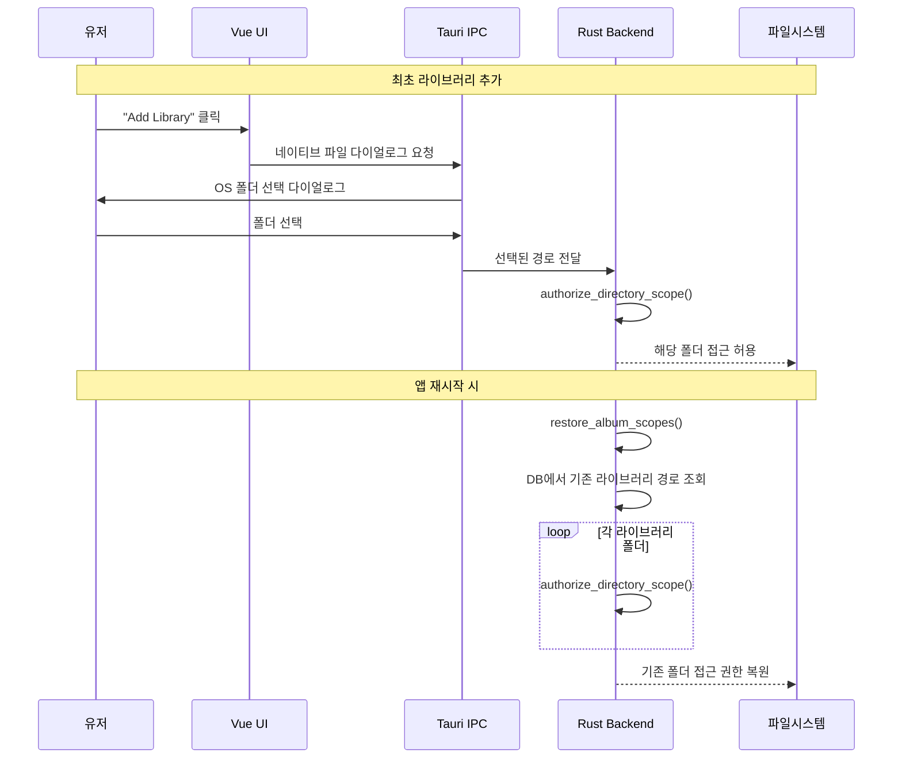
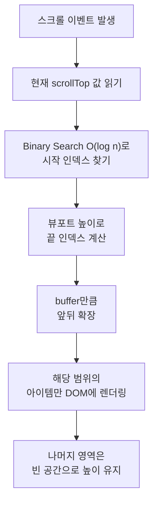
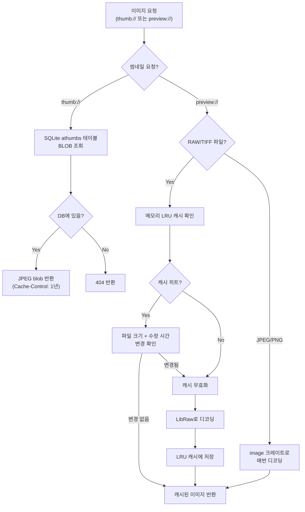

# Technical Concepts

이 프로젝트에 기여하기 전에 알아야 할 핵심 기술 개념들.

> **이 문서는 프로젝트 코드를 읽기 전에 알아두면 좋은 배경지식**을 모아놓은 것이다. 코드를 열어서 "이게 뭐지?" 하는 순간이 오면 여기로 돌아오자. 모든 개념을 한 번에 이해할 필요는 없다. 필요할 때 해당 섹션만 찾아 읽으면 된다.

---

## 1. Tauri Security Model

### Capability-Based Permissions
Tauri는 웹뷰 프론트엔드가 접근할 수 있는 범위를 엄격히 제한한다.

**`capabilities/default.json`**: 54개의 명시적 권한 부여
- 창 관리 (생성, 리사이즈, 최소화 등)
- 파일시스템 (`fs:default`, `fs:scope`)
- 다이얼로그 (`dialog:default`)
- 쉘 (`shell:allow-open`)

**Asset Protocol Scope** (`tauri.conf.json`):
```json
"scope": [
  "$HOME/**", "$PICTURES/**", "$VIDEOS/**",
  "/Volumes/**",         // macOS 외장 드라이브
  "/media/**", "/mnt/**" // Linux 마운트 포인트
]
```

### 폴더 접근 방식
1. 유저가 "Add Library" 클릭 → 네이티브 파일 다이얼로그
2. 유저가 폴더 선택 → Tauri가 경로 반환
3. `authorize_directory_scope()` 호출 → 해당 폴더 접근 허용
4. 앱 시작 시 `restore_album_scopes()` → 기존 라이브러리 폴더 권한 복원



**중요**: 스코프 밖 경로 접근 시도 시 실패한다. 디렉토리 트래버설 공격 방지.

> **비유: 아파트 보안 시스템**
> Tauri의 보안 모델은 아파트 보안 시스템과 비슷하다. 현관(다이얼로그)을 통해서만 입장이 가능하다. 방문자가 "502호에 가고 싶어요"라고 하면, 경비원이 502호에 전화해서 허가를 받은 후에만 출입증을 발급한다. 한번 허가받은 집(폴더)만 방문할 수 있고, 허가 없이 다른 집 문을 열려고 하면 거부된다. 그리고 다음에 다시 방문할 때는 이전 출입 기록(`restore_album_scopes`)이 있으므로 다시 허가받을 필요 없이 바로 입장 가능하다.

---

## 2. Custom URI Protocols

> **비유: 앱 내부 배달 시스템**
> Custom URI protocol은 앱 안에서만 통하는 전용 배달 시스템이다. `thumb://`는 편의점처럼 빠르고 작은 것(썸네일)을 즉시 전달한다. DB에 이미 준비된 데이터를 바로 꺼내주기 때문이다. `preview://`는 레스토랑처럼 시간이 좀 걸리지만 고품질의 결과물(원본 크기 이미지)을 제공한다. 디스크에서 파일을 읽고 디코딩하는 과정이 필요하기 때문이다.

### `thumb://` (동기)
```
thumb://localhost/{library_id}/{file_id}
```
- SQLite `athumbs` 테이블에서 JPEG blob 직접 반환
- 캐시 헤더: `Cache-Control: max-age=31536000, immutable` (1년)
- MIME 감지: magic bytes (PNG/JPEG/TIFF)

### `preview://` (비동기)
```
preview://localhost/{library_id}/{file_id}
```
- DB에서 파일 경로 조회 → 디스크에서 읽기 → 이미지 디코딩
- RAW/TIFF는 LRU 캐시 사용 (디코딩이 비싸므로)

### 플랫폼별 URL 차이
```typescript
// macOS: 커스텀 프로토콜 직접 지원
'thumb://localhost/...'

// Windows/Linux: WebView2/WebKit 호환을 위해 http:// 필요
'http://thumb.localhost/...'
```

---

## 3. Virtual Scrolling

`VirtualScroll.vue` — 수천 장의 사진을 렌더링하는 핵심 성능 기법.

> **비유: 연락처 앱**
> 폰에 연락처가 1000명이 저장되어 있다고 해보자. 연락처 앱을 열면 1000개의 항목을 동시에 그리지 않는다. 화면에 보이는 10개 정도만 실제로 그리고, 스크롤하면 위로 사라진 항목을 지우고 아래에 새 항목을 그린다. 마치 버스 안의 전광판이 한 번에 3줄만 보여주면서 계속 내용을 바꿔치기 하는 것과 같다. 이것이 Virtual Scrolling의 핵심이다.

### 원리
- **전체 리스트를 렌더링하지 않음** — 뷰포트에 보이는 항목만 DOM에 존재
- 스크롤 위치 기반으로 보이는 범위 계산
- 버퍼 영역 (뷰포트 위아래 추가 렌더링) → 스크롤 시 깜빡임 방지

### 가시 범위 계산
```
Binary Search O(log n)으로 시작 인덱스 찾기
→ 뷰포트 높이만큼 끝 인덱스 계산
→ buffer 만큼 앞뒤 확장
→ 해당 범위만 렌더링
```



### ResizeObserver
컨테이너 크기 변경 시 (사이드바 토글, 창 리사이즈) 레이아웃 재계산.
프로젝트 전체에서 6곳 사용.

---

## 4. Justified Layout

`layout.ts` — Google Photos 스타일의 양쪽 정렬 이미지 그리드.

> **비유: 신문 사진 배치**
> 신문 편집자가 사진을 배치할 때, 가로 너비에 맞춰서 사진의 높이를 조절해 빈 공간 없이 깔끔하게 배열한다. 가로가 긴 사진은 높이를 좀 줄이고, 세로가 긴 사진은 높이를 좀 키워서 한 줄에 맞춘다. 결과적으로 모든 행이 양쪽 끝에 딱 맞아떨어지며, Google Photos에서 보는 그 깔끔한 사진 그리드가 바로 이 알고리즘의 결과물이다.

### 알고리즘
```
목표 행 높이 (targetHeight) 설정
→ 이미지를 좌→우로 배치
→ 다음 이미지 추가 시 행 너비 초과하면:
  - "이전에 끊기" vs "포함해서 끊기" 비교
  - targetHeight에 가까운 쪽 선택
→ 행 확정 시: rowHeight = availableWidth / totalAspectRatio
→ 마지막 행: targetHeight 유지, 오른쪽 빈 공간 허용
```

### 회전 처리
90°/270° 회전된 이미지는 width/height를 스왑해서 aspect ratio 계산.

---

## 5. ONNX Runtime

### 개념
- ONNX = Open Neural Network Exchange
- 학습된 AI 모델을 다양한 플랫폼에서 실행하는 표준 포맷
- `ort` 크레이트가 Rust에서 ONNX 모델 추론 담당

### 이 프로젝트의 모델들
| 모델 | 입력 | 출력 | 용도 |
|------|------|------|------|
| CLIP Vision | 224x224 RGB 이미지 | 512-dim 벡터 | 이미지 → 임베딩 |
| CLIP Text | 토큰 시퀀스 | 512-dim 벡터 | 텍스트 → 임베딩 |
| RetinaFace | ≤640px 이미지 | bbox + confidence | 얼굴 검출 |
| MobileFaceNet | 얼굴 크롭 | 128-dim 벡터 | 얼굴 임베딩 |

### ONNX 세션 설정
```rust
Session::builder()
    .with_optimization_level(GraphOptimizationLevel::Level3)  // 그래프 최적화
    .with_intra_threads(4)  // 추론 당 4 스레드 제한
    .commit_from_file(&model_path)?;
```

---

## 6. CLIP (Contrastive Language-Image Pre-training)

### 개념
이미지와 텍스트를 **같은 벡터 공간**에 매핑하는 모델.
"고양이"라는 텍스트와 고양이 사진의 벡터가 가까워짐.

### 이 프로젝트에서의 활용
1. **인덱싱 시**: 각 사진 → CLIP Vision → 512-dim 벡터 → DB 저장
2. **검색 시**: 검색어 → CLIP Text → 512-dim 벡터 → 모든 사진 벡터와 cosine similarity → 순위

### 이미지 전처리
```
리사이즈 224x224
→ 정규화: mean=[0.48145, 0.45783, 0.40821], std=[0.26863, 0.26130, 0.27578]
→ ONNX 추론
→ L2 정규화된 512-dim 벡터
```

### Cosine Similarity

> **쉽게 말하면**: 두 벡터(화살표)의 **방향**이 얼마나 같은지를 측정한다.
> - 같은 방향을 가리키면 = **1.0** (매우 관련 있음)
> - 수직(90도)이면 = **0.0** (관련 없음)
> - 반대 방향이면 = **-1.0** (정반대)
>
> 사진과 검색어가 같은 방향을 가리키면 "관련 있는 것"이라고 판단한다. 예를 들어 "고양이" 텍스트 벡터와 고양이 사진 벡터는 거의 같은 방향(1.0에 가까운 값)을 가리키고, "자동차" 텍스트 벡터와 고양이 사진 벡터는 다른 방향(0.0에 가까운 값)을 가리킨다.

```
similarity = dot_product(vec_a, vec_b)
// L2 정규화된 벡터면 dot product = cosine similarity
// 범위: -1.0 ~ 1.0 (1.0 = 동일)
```

---

## 7. 얼굴 인식 파이프라인

### RetinaFace (검출)
- Multi-scale feature pyramid: stride 8, 16, 32
- Anchor-based detection → NMS (Non-Maximum Suppression)
- 출력: bounding box + 5 landmarks (양쪽 눈, 코, 양쪽 입꼬리)

### MobileFaceNet (임베딩)
- 검출된 얼굴 → 크롭 & 정렬 → 128-dim 벡터
- L2 정규화 → cosine distance로 유사도 비교

### Chinese Whispers (클러스터링)
- **클러스터 수를 미리 지정하지 않음** (K-Means와 다름)
- 그래프 기반: 각 얼굴 = 노드, 유사한 얼굴끼리 엣지 연결
- 반복적 라벨 전파: 이웃 중 가장 빈번한 라벨을 채택
- 수렴 시 같은 라벨 = 같은 사람

### 품질 필터
```rust
MIN_CONFIDENCE: 0.65    // 검출 신뢰도 (낮으면 무시)
MIN_BLUR_SCORE: 200.0   // Laplacian variance (흐릿한 얼굴 제외)
K_NEIGHBORS: 80          // KNN 그래프 최대 이웃 수
```

---

## 8. 동시성 패턴

### Tokio + spawn_blocking
```
Tauri 이벤트 루프 (async, tokio)
  └── spawn_blocking() → CPU-heavy 작업 (이미지 편집, 설정 로드)
  └── spawn() → 백그라운드 태스크 (얼굴 인덱싱)
```
- **async runtime을 블로킹하지 않는 것이 핵심**
- 이미지 디코딩, 해싱 등은 반드시 `spawn_blocking`으로

### 취소 패턴
```rust
// AtomicBool — 빠른 체크 (lock 불필요, hot path용)
if cancel_flag.load(Ordering::SeqCst) { break; }

// Mutex<bool> — 복잡한 상태와 함께 사용
let mut status = status.lock().unwrap();
```

| 용도 | 타입 | 이유 |
|------|------|------|
| 스캔 취소 | `AtomicBool` | 매 파일마다 체크, lock 오버헤드 불가 |
| 진행 상태 | `Mutex<Status>` | 여러 필드 동시 업데이트 필요 |
| 앨범별 취소 | `Mutex<HashMap<i64, bool>>` | 앨범 ID별 독립 취소 |

### 프로그레스 이벤트
```rust
// 10개 파일마다 UI 업데이트 (이벤트 폭주 방지)
if current % 10 == 0 || current == total_files {
    app_handle.emit("face_index_progress", payload);
}
```

---

## 9. 크로스 플랫폼

### FFmpeg 링킹
| 플랫폼 | 방식 | 이유 |
|--------|------|------|
| macOS/Linux | Static linking (`features = ["static", "build"]`) | 런타임 의존성 없음 |
| Windows | Dynamic linking (DLL 번들) | 빌드 호환성 |

### 윈도우 설정 차이
- `decorations: false` + `transparent: true` → 커스텀 윈도우 프레임
- `resources/ffmpeg/*.dll` 번들링 필요

### macOS 설정 차이
- `titleBarStyle: "Overlay"` → 커스텀 타이틀바
- `hiddenTitle: true`, `acceptFirstMouse: true`
- `macos-private-api` feature 활성화

### 프론트엔드 플랫폼 분기
```typescript
export const isMac = getOS() === 'mac';
export const isWin = getOS() === 'win';
export const separator = isWin ? '\\' : '/';
```

---

## 10. 썸네일 캐싱 전략

### DB 캐시 (athumbs 테이블)
- 인덱싱 시 생성, SQLite BLOB으로 저장
- `thumb://` 프로토콜로 서빙 → 1년 캐시 헤더

### 메모리 LRU 캐시 (preview용)
```rust
struct FileImageResultCache {
    entries: HashMap<String, CacheEntry>,
    order: VecDeque<String>,  // LRU 순서
}
```
- **RAW/TIFF만 캐시** (디코딩이 비싸므로)
- JPEG/PNG는 매번 디코드 (이미 빠름)
- 캐시 무효화: 파일 크기 + 수정 시간 기반



---

## 11. 알아두면 좋은 개념

### Letterbox Resizing
이미지를 모델 입력 크기에 맞출 때 aspect ratio를 유지하면서 패딩 추가.
얼굴 검출에서 640px 입력에 맞출 때 사용.

> **비유: TV 화면에 영화 맞추기**
> 와이드 영화(21:9)를 일반 TV(16:9)에서 재생하면 위아래에 검은 띠가 생긴다. 영화를 찌그러뜨리지 않고 원래 비율을 유지하면서 화면에 맞추기 때문이다. Letterbox Resizing도 같은 원리다. AI 모델은 640x640 정사각형 입력을 기대하는데, 직사각형 사진을 정사각형에 억지로 우겨넣으면 얼굴이 찌그러진다. 그래서 비율을 유지하면서 남는 공간은 검정(또는 회색)으로 패딩을 채운다.

### NMS (Non-Maximum Suppression)
같은 얼굴에 대해 여러 bbox가 검출되면, IOU(겹침 비율)가 높은 것들 중 confidence가 가장 높은 것만 남기는 후처리.

> **비유: 명찰 정리**
> 회의에서 같은 사람에게 실수로 명찰을 3개 붙였다고 해보자. "김철수(90% 확신)", "김철수(70% 확신)", "김철수(50% 확신)" — 이 중 가장 확실한 것(90%)만 남기고 나머지는 제거한다. AI가 얼굴을 검출할 때도 같은 얼굴 위치에 여러 개의 박스가 겹쳐서 나오는데, NMS가 가장 확실한 것만 남기고 중복을 정리한다.

### Laplacian Variance
이미지 선명도 측정. Laplacian 필터 적용 후 분산 계산.
값이 낮으면 흐릿함 → 얼굴 인식 품질 떨어지므로 제외.

### L2 Normalization
벡터를 단위 벡터로 만들기: `v / ||v||`
이렇게 하면 dot product = cosine similarity가 되어 계산이 간단해짐.

### EXIF Orientation
JPEG 파일의 EXIF에는 회전 정보가 1~8 값으로 저장됨.
실제 픽셀 데이터는 안 바뀌고, 뷰어가 이 값을 보고 회전 표시.
이 프로젝트는 `apply_orientation()`에서 이를 처리.

> **비유: 사진의 자동 메모**
> EXIF는 사진을 찍을 때 카메라가 자동으로 기록하는 메타데이터다. 날짜, 시간, GPS 위치, 카메라 종류, 렌즈, ISO, 조리개 값 등이 사진 파일 안에 숨겨져 있다. 마치 편지 봉투 뒷면에 "2024년 3월 15일, 서울, Canon R5로 촬영"이라고 자동으로 메모가 적히는 것과 같다. Orientation 값은 그 중에서 "이 사진을 어떤 방향으로 보여줘야 하는지"를 알려주는 항목이다. 폰을 세로로 들고 찍으면 실제 픽셀은 가로로 저장되지만, EXIF orientation 값이 "90도 회전해서 보여줘"라고 알려준다.
