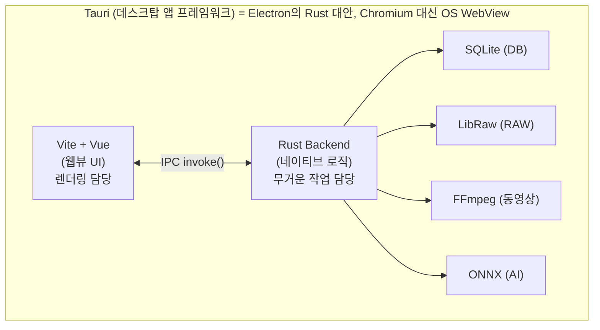
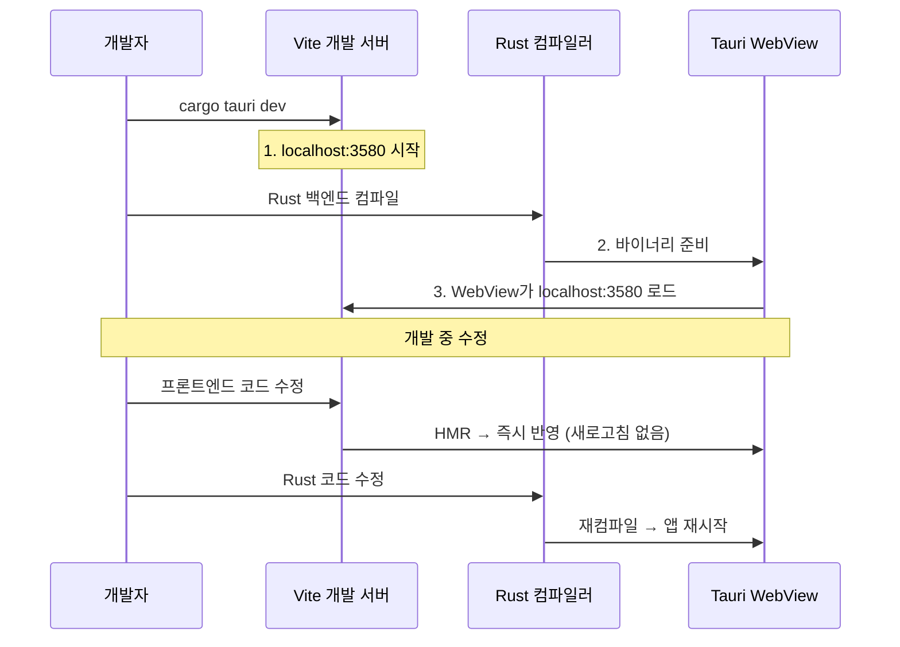
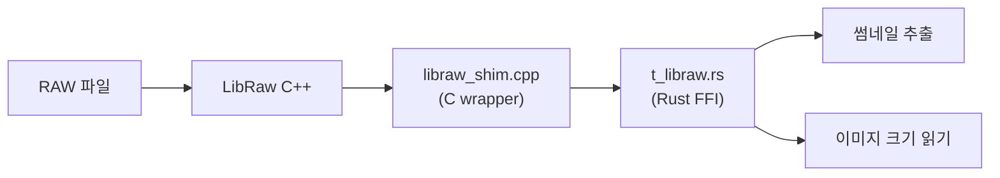
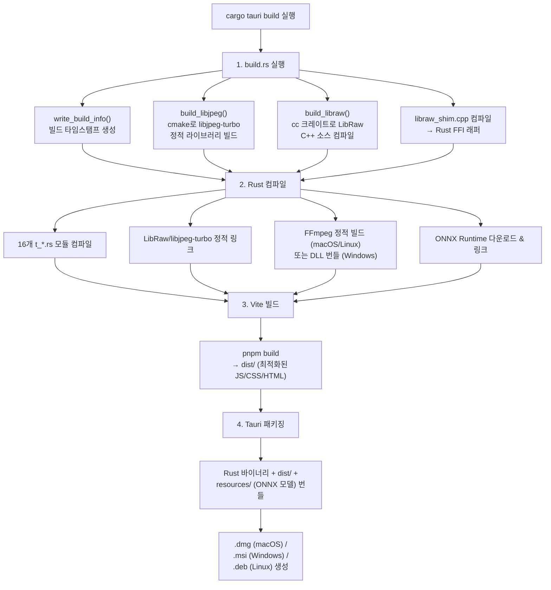
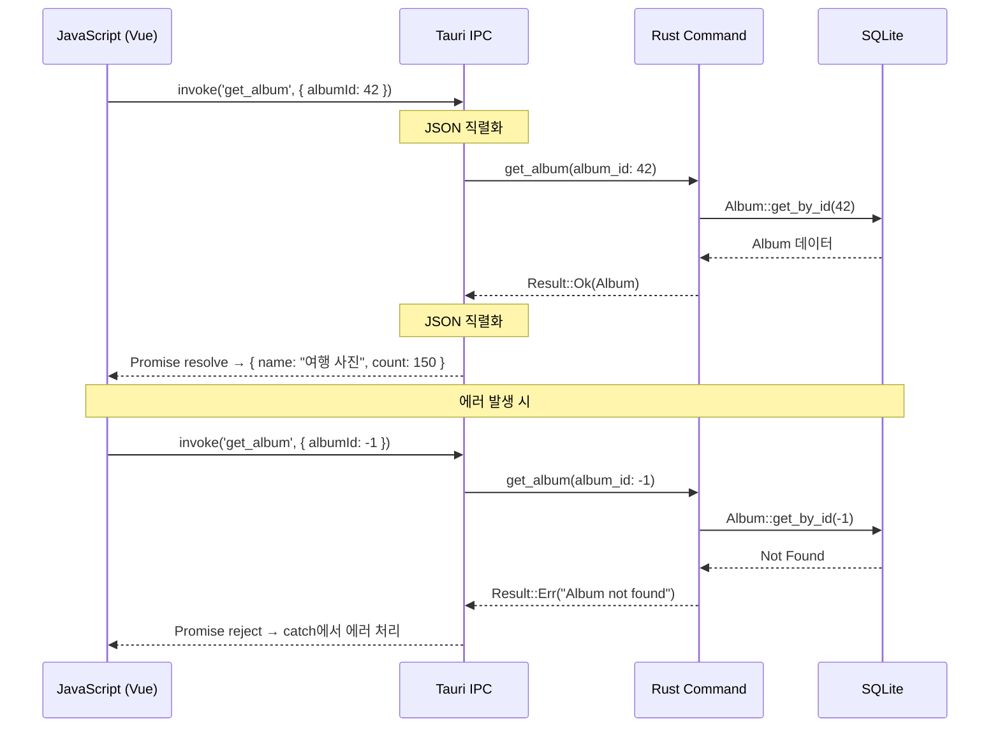
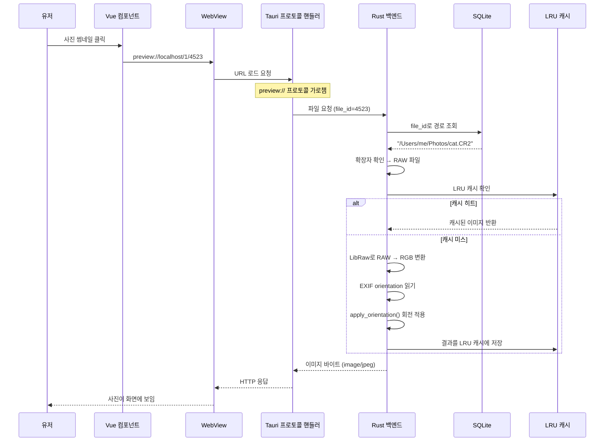
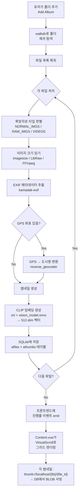
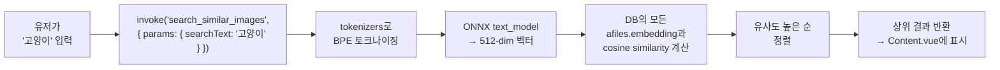
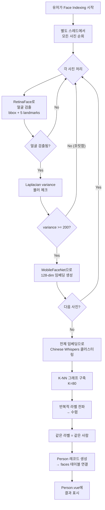

# How It Works — 핵심 동작 원리

이 앱이 실제로 어떻게 돌아가는지, 각 기술이 무슨 문제를 해결하는지 설명.

---

## 비유로 이해하기

Lap을 **도서관**에 비유하면:

| 비유 | 실제 |
|------|------|
| 도서관 건물 | Tauri (앱 껍데기) |
| 사서 (책 정리, 검색, 관리) | Rust 백엔드 |
| 열람실 인테리어 (책장, 의자, 조명) | Vue 프론트엔드 |
| 도서 카드 목록 (책 위치, 정보) | SQLite 데이터베이스 |
| 책에서 요약 발췌 | 썸네일 생성 |
| "이 책과 비슷한 책 추천" | CLIP AI 검색 |
| "이 저자의 다른 책 모아보기" | 얼굴 인식 + 클러스터링 |

**핵심**: 유저는 열람실(Vue UI)에서 책을 보지만, 실제 무거운 작업(정리, 검색, 분류)은 사서(Rust)가 뒤에서 다 한다.

---

## 전체 구조: 누가 뭘 하나



### 쉽게 말하면
- **Vue (프론트엔드)** = 유저가 보는 화면. 버튼, 사진 그리드, 설정 페이지 등. 웹 기술로 만듦.
- **Rust (백엔드)** = 화면 뒤에서 일하는 엔진. 사진 읽기, DB 저장, AI 돌리기, 동영상 처리 등.
- **Tauri** = 이 둘을 연결하는 다리. "프론트엔드야, 이 사진 목록 줄게" / "백엔드야, 이 사진 검색해줘"
- **SQLite** = 모든 정보가 저장되는 파일. 사진 경로, 메타데이터, 썸네일, AI 벡터 전부 여기에.

---

## Tauri가 하는 일

**문제**: 데스크탑 앱을 만들고 싶은데 Electron은 Chromium 통째로 번들해서 200MB+.

**해결**: Tauri는 OS에 내장된 WebView(macOS=WebKit, Windows=WebView2, Linux=WebKitGTK)를 쓴다.
- 앱 크기 대폭 감소
- 백엔드는 Rust → 네이티브 성능 (이미지, AI 처리에 필수)
- 프론트엔드는 웹 기술 (Vue, React 등 아무거나)

**비유**: Electron은 집마다 브라우저를 하나씩 설치하는 것. Tauri는 집에 이미 있는 창문(OS WebView)을 그대로 사용하는 것.

**이 프로젝트에서의 역할**:
1. **윈도우 관리** — 앱 창 생성, 커스텀 타이틀바, 창 상태 저장/복원
2. **IPC 브리지** — 프론트엔드 `invoke('command')` → Rust 함수 호출 → 결과 반환
3. **보안 샌드박스** — 파일시스템 접근 범위 제한 (유저가 허용한 폴더만)
4. **플러그인 시스템** — 파일 다이얼로그, 쉘, 자동 업데이트 등
5. **커스텀 프로토콜** — `thumb://`, `preview://` URI로 이미지 서빙
6. **빌드/배포** — .dmg, .msi, .deb 인스톨러 자동 생성

---

## Vite가 하는 일

**문제**: Vue 컴포넌트(.vue), TypeScript, Tailwind CSS를 브라우저가 이해하는 JS/CSS로 변환해야 함.

**비유**: `.vue` 파일은 한국어로 쓴 레시피. 브라우저는 영어만 읽을 수 있음. Vite는 이걸 실시간으로 번역해주는 통역사.

**해결**: Vite는 개발 시 빠른 HMR(Hot Module Replacement), 프로덕션 시 최적화된 번들 생성.
- **HMR이란?** 코드를 수정하면 전체 페이지를 새로고침하지 않고, 바뀐 컴포넌트만 즉시 교체됨. 개발 속도가 매우 빨라짐.

**이 프로젝트에서의 역할**:
1. **개발 서버** — `localhost:3580`에서 Vue 앱 실행, 코드 수정 시 즉시 반영
2. **빌드** — `pnpm build` → `dist/` 폴더에 최적화된 HTML/JS/CSS 생성
3. **플러그인**: SVG를 Vue 컴포넌트로 변환, Tailwind CSS 처리, Vue DevTools

**Tauri와의 관계**:


---

## 서브모듈이 하는 일

### LibRaw (`third_party/LibRaw`)

**문제**: 카메라 RAW 파일(CR2, NEF, ARW 등 20+ 포맷)을 읽어야 하는데, 각 제조사마다 포맷이 다름.

**비유**: RAW 파일은 각 카메라 제조사가 자기만의 언어로 쓴 일기장. Canon은 CR2, Nikon은 NEF, Sony는 ARW... LibRaw는 이 모든 언어를 읽을 수 있는 만능 번역기.

**해결**: LibRaw는 C++ 라이브러리로, 거의 모든 카메라 RAW 포맷을 디코딩.

**이 프로젝트에서의 사용**:
- `build.rs`에서 C++ 소스를 직접 컴파일 (서브모듈에서)
- `t_libraw.rs`가 C++ 함수를 Rust FFI로 호출
- `libraw_shim.cpp` = Rust에서 호출하기 쉬운 C 인터페이스 래퍼



### libjpeg-turbo (`third_party/libjpeg-turbo`)

**문제**: LibRaw가 디코딩한 RAW 이미지를 JPEG 썸네일로 저장해야 함. 표준 JPEG 인코더는 느림.

**해결**: libjpeg-turbo는 SIMD 최적화된 JPEG 인코더/디코더. 2-6배 빠름.

**이 프로젝트에서의 사용**:
- `build.rs`에서 cmake로 빌드
- LibRaw가 내부적으로 사용 (RAW에서 추출한 JPEG 썸네일 디코딩)
- **이것 때문에 cmake가 필요한 것** (네가 PR에 추가한 이유)

---

## 핵심 라이브러리별 역할

### 데이터 저장: rusqlite (SQLite)

**문제**: 수만 장의 사진 메타데이터를 빠르게 검색/필터링해야 함.

**왜 SQLite?**:
- 서버 불필요 (파일 하나가 DB)
- 오프라인 동작 (클라우드 불필요)
- 라이브러리별 독립 DB 파일

**저장하는 것**: 파일 경로, EXIF 메타데이터, 썸네일(BLOB), AI 임베딩 벡터, 얼굴 데이터, 태그, 중복 해시

> **쉽게 말하면**: 엑셀 파일이라고 생각하면 된다. 시트(테이블)가 여러 개 있고, 각 시트에 행(row)과 열(column)이 있다. `afiles` 시트에는 사진 정보가, `athumbs` 시트에는 썸네일 이미지가, `faces` 시트에는 얼굴 데이터가 들어있다. 다만 엑셀보다 훨씬 빠르고, 여러 작업이 동시에 접근해도 안전하며, 수십만 행도 거뜬히 처리한다.

### 이미지 처리: image crate

**문제**: JPEG, PNG, WebP, AVIF 등 다양한 이미지 포맷을 로드/리사이즈/회전/편집해야 함.

**해결**: Rust `image` 크레이트가 포맷 디코딩 + 기본 이미지 조작 제공.

**사용처**: 썸네일 생성, 이미지 편집(자르기, 회전, 밝기 조절), EXIF orientation 적용

> **쉽게 말하면**: 포토샵의 기본 기능만 모아놓은 라이브러리다. 이미지 열기, 리사이즈, 회전, 밝기 조절 같은 핵심 기능만 있다. 포토샵처럼 레이어나 필터는 없지만, 이 프로젝트에서 필요한 이미지 조작은 전부 커버한다.

### 동영상 처리: ffmpeg-next (FFmpeg)

**문제**: MP4, MOV, MKV 등 동영상에서 프레임 추출, 재생 시간, 해상도 읽기가 필요.

**해결**: FFmpeg는 거의 모든 미디어 포맷을 다루는 C 라이브러리. `ffmpeg-next`는 Rust 바인딩.

**특이점**:
```toml
# macOS/Linux: 소스에서 빌드해서 정적 링킹 (런타임 의존성 없음)
ffmpeg-next = { features = ["static", "build"] }

# Windows: 동적 링킹 (DLL 번들)
ffmpeg-next = { version = "8.1.0" }
```

**사용처**: 동영상 썸네일 추출, 해상도/회전 감지, 재생 시간 계산

### AI 추론: ort (ONNX Runtime)

**문제**: 사진 검색(CLIP)과 얼굴 인식을 로컬에서 돌려야 함. Python 없이.

**해결**: ONNX Runtime은 학습된 AI 모델을 효율적으로 실행하는 C++ 추론 엔진. `ort`는 Rust 바인딩.

> **쉽게 말하면**: AI 모델은 보통 Python으로 학습하지만, 실행은 ONNX 포맷으로 변환하면 어디서든 가능하다. Java 앱, iOS 앱, Rust 앱 다 가능하다. Lap은 Python을 설치하지 않고도 Rust에서 직접 AI 모델을 실행한다. ONNX는 "AI 모델의 USB"라고 생각하면 된다 -- 어떤 컴퓨터에 꽂아도 작동하는 표준 규격이다.

**사용처**:
- CLIP 모델 → 사진을 512차원 벡터로 변환 → "고양이" 검색하면 고양이 사진 찾기
- RetinaFace 모델 → 사진에서 얼굴 위치 검출
- MobileFaceNet 모델 → 얼굴을 128차원 벡터로 → 같은 사람 클러스터링

### 텍스트 토크나이저: tokenizers

**문제**: CLIP 텍스트 검색 시 한글/영어 텍스트를 모델이 이해하는 토큰 시퀀스로 변환해야 함.

**해결**: HuggingFace `tokenizers` 크레이트 — BPE(Byte Pair Encoding) 토크나이저.

### EXIF 메타데이터: kamadak-exif

**문제**: 사진의 촬영 날짜, 카메라, 렌즈, GPS 좌표, ISO 등 메타데이터 읽기.

**해결**: EXIF 표준 파서. JPEG/TIFF 파일에서 메타데이터 추출.

### 역지오코딩: reverse_geocoder

**문제**: GPS 좌표 (37.5665, 126.9780)를 "서울"로 변환해야 함.

**해결**: 오프라인 역지오코딩. 좌표 → 가장 가까운 도시/지역 매핑. 인터넷 불필요.

### 파일 해싱: blake3

**문제**: 중복 파일 탐지를 위해 파일 내용을 해시해야 함. SHA-256은 느림.

**해결**: BLAKE3는 SHA-256보다 수배 빠른 해시 함수.

> **쉽게 말하면**: 파일의 지문이다. 사람마다 고유한 지문이 있듯이, 같은 내용의 파일이면 항상 같은 해시(지문)가 나온다. 파일 이름이 달라도, 폴더가 달라도, 내용이 같으면 같은 지문이 나온다. 수만 장의 사진 중 복사본(중복 파일)을 찾을 때 하나하나 비교하지 않고 지문만 비교하면 순식간에 찾을 수 있다.

### 중국어 병음: pinyin

**문제**: 중국어 폴더/파일명 정렬 시 한자 순서가 아닌 발음(병음) 순 정렬 필요.

**해결**: 한자 → 병음 변환 크레이트.

---

## 프론트엔드 핵심 라이브러리

### Pinia (상태 관리)

**문제**: 46개 Vue 파일(42개 컴포넌트 + 4개 뷰)이 공유하는 상태(현재 앨범, 설정, UI 상태)를 관리해야 함.

**해결**: Vue 3 공식 상태 관리. 3개 스토어:
- `configStore` — 앱 설정 (localStorage에 persist)
- `libraryStore` — 라이브러리별 상태 (Rust 백엔드에 persist)
- `uiStore` — 임시 UI 상태 (persist 안 함)

### daisyUI + Tailwind CSS (스타일링)

**문제**: 일관된 UI 디자인. 34개 테마 지원. CSS 작성 최소화.

**해결**: Tailwind = 유틸리티 클래스. daisyUI = 그 위에 컴포넌트 클래스 (`btn`, `modal`, `badge` 등).

### Leaflet (지도)

**문제**: GPS 태그된 사진을 지도에 표시.

**해결**: 오픈소스 지도 라이브러리. OpenStreetMap 타일 사용.

### video.js (동영상 재생)

**문제**: 웹뷰에서 다양한 포맷의 동영상 재생.

**해결**: 범용 웹 비디오 플레이어.

### vue-i18n (다국어)

**문제**: 9개 언어 지원 (en, zh, es, fr, de, ja, ko, ru, pt).

**해결**: Vue 국제화 플러그인. `$t('key')` 로 번역 문자열 접근.

---

## 빌드 파이프라인이 하는 일



---

## IPC 통신이 실제로 어떻게 생겼나?

프론트엔드(Vue)와 백엔드(Rust) 사이의 통신은 `invoke`를 통해 이루어진다. 실제 코드가 어떻게 생겼는지 보자.

### JavaScript 측 (호출하는 쪽)
```typescript
// Vue 컴포넌트에서 앨범 정보를 요청하는 예시
import { invoke } from '@tauri-apps/api/core';

// invoke('함수이름', { 인자들 }) → Promise<결과>
const album = await invoke('get_album', { albumId: 42 });
console.log(album.name);  // "여행 사진"
console.log(album.count); // 150
```

### Rust 측 (처리하는 쪽)
```rust
// 같은 이름의 Tauri command가 호출을 받는다
#[tauri::command]
pub fn get_album(album_id: i64) -> Result<Album, String> {
    // DB에서 앨범 조회
    let album = Album::get_by_id(album_id)
        .map_err(|e| e.to_string())?;
    Ok(album)  // → JSON으로 자동 변환되어 JS에 전달
}
```

### 흐름 요약



`invoke`는 항상 Promise를 반환하므로 `await`로 기다린다. 에러가 발생하면 `Result::Err(String)`이 JS 측에서 catch로 잡힌다.

---

## 사진 한 장을 볼 때 일어나는 일

사진 그리드에서 사진 하나를 클릭해서 화면에 보이기까지, 내부에서 어떤 일이 벌어지는지 단계별로 살펴보자.



**JPEG/PNG일 때는 더 간단하다**: 5b에서 LibRaw 대신 `image` 크레이트로 디코딩하고, 캐시를 사용하지 않는다 (이미 충분히 빠르므로).

**동영상일 때는**: FFmpeg로 특정 프레임을 추출해서 반환한다.

---

## 핵심 데이터 흐름 요약

### 사진 한 장이 앱에 등록되기까지



### "고양이" 검색했을 때



### 얼굴 인식했을 때


