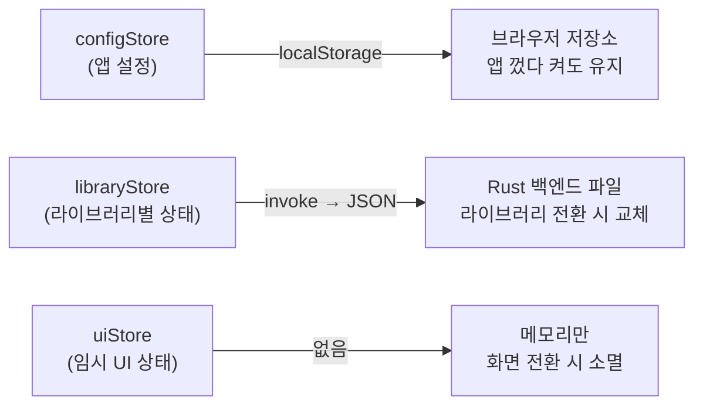
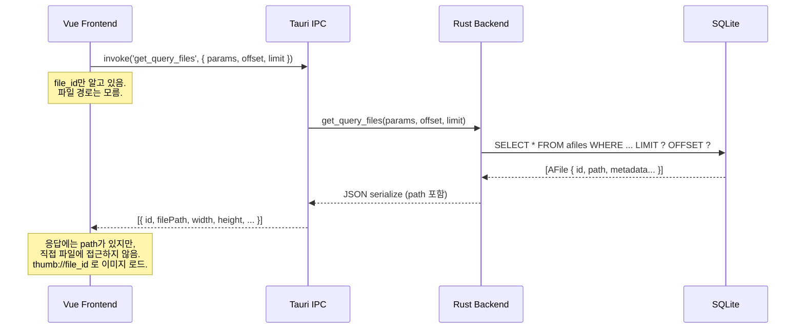
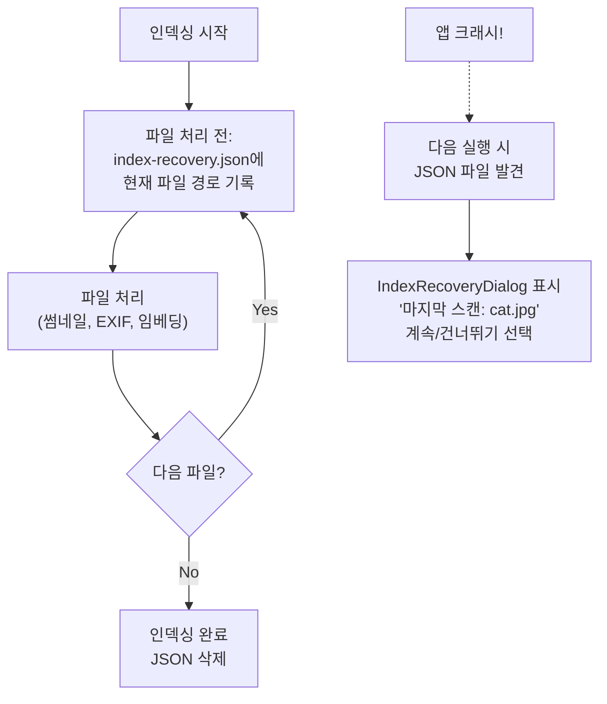
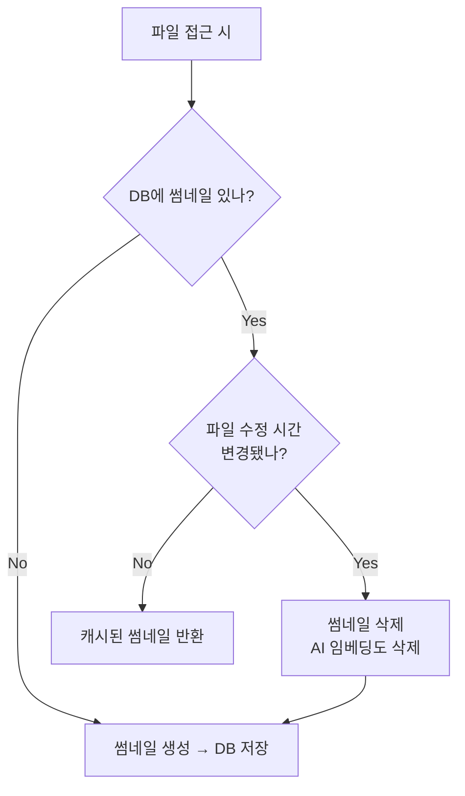
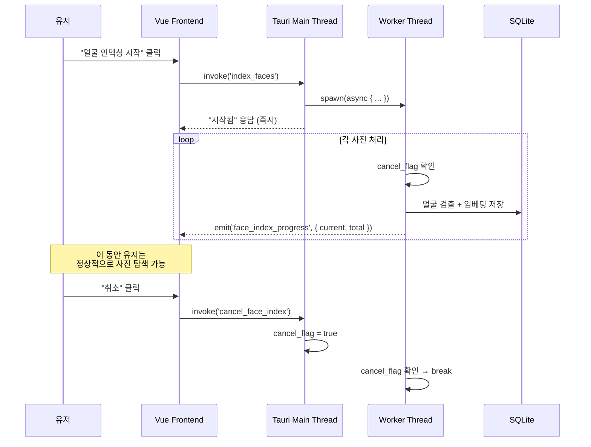
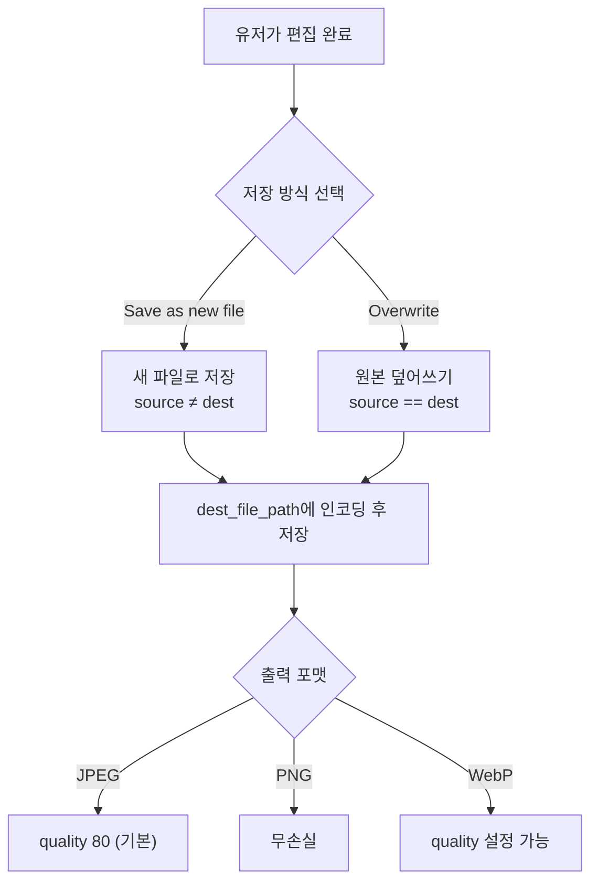

# Engineering Tradeoffs — 개발자가 고민했을 것들

코드 한 줄 한 줄 뒤에는 "이렇게 할까, 저렇게 할까"의 판단이 있다. 이 문서는 Lap의 코드에서 발견되는 설계 고민과 트레이드오프를 정리한 것이다.

---

## 1. 상태 관리: "이 데이터는 어디에 저장해야 하나?"

42개 컴포넌트가 다루는 수십 가지 상태에 대해, 각각 "어디에, 얼마나 오래 보관할 것인가?"를 결정해야 했다.

### 3계층 분리



| 스토어 | 저장 위치 | 수명 | 예시 |
|--------|-----------|------|------|
| configStore | localStorage | 앱 삭제 전까지 | 테마, 그리드 크기, 비디오 볼륨, 에디터 설정 |
| libraryStore | 백엔드 JSON (`{library-id}-state.json`) | 라이브러리별 | 선택된 앨범, 검색 히스토리, 캘린더 날짜 |
| uiStore | 메모리 (persist 안 함) | 세션 동안만 | 활성 패널, 모달 스택, 파일 버전 캐시 |

### 이게 왜 어려운가?

모든 상태에 대해 이런 질문을 해야 했다:

- **"비디오 볼륨"** → 앱을 껐다 켜도 남아야 함 → configStore (localStorage)
- **"현재 선택된 앨범"** → 같은 라이브러리에서는 유지, 라이브러리 바꾸면 리셋 → libraryStore (백엔드)
- **"모달 다이얼로그가 열려있나?"** → 화면 전환하면 사라져야 함 → uiStore (메모리)
- **"검색 히스토리"** → 라이브러리별로 다름 → libraryStore
- **"그리드 레이아웃 스타일"** → 모든 라이브러리에서 동일 → configStore

잘못 분류하면: 라이브러리를 바꿨는데 이전 검색 히스토리가 남아있거나, 앱을 껐다 켰는데 설정이 초기화되는 버그가 생긴다.

### 왜 libraryStore를 SQLite가 아니라 JSON에 저장하나?

**DB에 넣으면**: 라이브러리 전환할 때마다 DB 연결을 열고 닫아야 함. 스키마 변경 시 마이그레이션 필요.
**JSON에 넣으면**: `serde_json::from_str` 한 줄로 로드/세이브. 스키마 변경도 `#[serde(default)]`로 해결.

트레이드오프: JSON은 복잡한 쿼리가 불가능하지만, UI 상태에는 쿼리가 필요 없으므로 JSON이 더 적합하다.

---

## 2. IPC 경계: "프론트엔드에 뭘 보여주고, 뭘 숨길 것인가?"

### 98개 커맨드의 설계 원칙



**핵심 결정**: 프론트엔드는 `file_id`로 모든 작업을 요청한다. 파일 경로는 응답에 포함되지만 **파일 접근은 항상 Rust를 통해서만** 가능하다.

### 왜 이렇게 했을까?

1. **보안**: WebView에서 `file:///Users/me/private/photo.jpg` 직접 접근 방지
2. **추상화**: RAW든 JPEG든 동영상이든, 프론트엔드는 `thumb://localhost/1/4523`만 알면 됨
3. **캐싱**: custom protocol에서 `Cache-Control: immutable` 헤더를 붙일 수 있음

### 트레이드오프: N+1 쿼리 문제

```javascript
// api.js:146-161 — 앨범을 불러올 때 favorite 상태를 별도 호출
export async function getAllAlbums() {
    const albums = await invoke('get_all_albums');
    for (const album of albums) {
        for (const folder of album.folders) {
            folder.is_favorite = await invoke('get_folder_favorite', { path: folder.path });
        }
    }
    return albums;
}
```

앨범 10개에 폴더 100개면 → 101번의 IPC 호출. **배치 API를 만들면 1번으로 줄일 수 있지만**, API 복잡도가 올라간다. 개인 사진 라이브러리 규모(앨범 수십 개)에서는 이 정도 오버헤드가 체감되지 않으므로 **단순함을 선택**한 것.

---

## 3. 크래시 복구: "인덱싱 중에 앱이 죽으면?"

수만 장의 사진을 인덱싱하는 도중 앱이 크래시하면? 처음부터 다시?

### 해결: JSON 트레이스 파일



**작동 방식** (`t_utils.rs:1030-1079`):
1. 파일을 처리하기 **전에** `index-recovery-{libraryId}.json`에 현재 파일 경로 기록
2. 정상 완료 시 JSON 삭제
3. 앱이 크래시하면 JSON이 남아있음
4. 다음 실행 시 JSON 발견 → 복구 다이얼로그 표시

**추가 안전장치**: 앱 재시작 시 `libraryStore.init()`에서 `index.status === 1`(인덱싱 중)이면 `2`(일시정지)로 강제 전환. 자동 재개하지 않음.

### 트레이드오프

매 파일마다 JSON 파일을 쓰는 건 I/O 오버헤드가 있다. 하지만 SQLite 트랜잭션으로 하면 DB 잠금 문제가 생길 수 있고, 아무것도 안 하면 크래시 시 진행 상황을 잃는다. 가장 단순하고 안전한 방법을 선택한 것.

---

## 4. 썸네일 정책: "언제 다시 만들 것인가?"

### 무효화 조건



**핵심 코드** (`t_sqlite.rs:1360-1390`):
```rust
let modified = file.modified_at != file_info.modified;
if modified {
    AThumb::delete(file_id);           // 썸네일 삭제
    conn.execute("UPDATE afiles SET embeds = NULL ...");  // 임베딩도 삭제
}
```

### 왜 임베딩까지 삭제하나?

파일이 수정되었다는 건 이미지 내용이 바뀌었을 수 있다는 뜻이다. (예: 외부 에디터에서 편집) 이 경우 AI 임베딩(사진의 "DNA")도 더 이상 유효하지 않다.

**보수적 전략**: "의심스러우면 버린다." 잘못된 캐시를 보여주는 것보다, 다시 생성하는 게 낫다.

**대안이었을 것**: 파일 해시(BLAKE3)로 비교하면 내용이 진짜 바뀌었는지 정확히 알 수 있다. 하지만 수만 장의 파일을 매번 해시하는 건 너무 비싸다. mtime 비교는 O(1)이고, 거짓 양성(false positive)이 발생해도 썸네일을 다시 만드는 비용은 수용 가능하다.

---

## 5. 동시성: "인덱싱 중에 사진을 볼 수 있어야 한다"

### 문제

얼굴 인덱싱은 사진 한 장당 수백ms가 걸린다. 1만 장이면 수십 분. 이 동안 유저가 사진을 못 보면 쓸 수 없는 앱이다.

### 해결: 별도 스레드 + 플래그 기반 취소



### 프로그레스 이벤트 빈도 조절

```rust
// 매 파일마다 emit하면 이벤트가 너무 많아 UI가 버벅거림
if current % 10 == 0 || current == total_files {
    app_handle.emit("face_index_progress", payload);
}
```

10개 파일마다 한 번 UI 업데이트. 1만 장이면 1,000번의 이벤트 (매 파일이면 10,000번).

### 트레이드오프

**간단한 플래그 vs 복잡한 스레드 관리**: `AtomicBool` 플래그는 구현이 단순하지만, "취소"를 누른 후 현재 처리 중인 파일이 끝날 때까지 기다려야 한다. 즉시 중단하려면 스레드 중단(abort)이 필요한데, 이는 리소스 누수 위험이 있다.

**라이브러리 전환 시 문제**: 유저가 A 라이브러리에서 인덱싱을 시작하고, B 라이브러리로 전환하면? Worker 스레드는 A 라이브러리의 DB에 계속 쓴다. 프론트엔드는 B를 보고 있는데 프로그레스 이벤트는 A에서 오는 상태. 명시적으로 취소하지 않으면 혼란스러울 수 있다.

---

## 6. 이미지 편집: "원본을 건드릴 것인가?"

### 저장 전략



**핵심**: 프론트엔드가 `sourceFilePath`와 `destFilePath`를 모두 지정한다. 백엔드는 판단하지 않고 요청대로 저장한다.

### RAW 편집의 한계

RAW 파일(CR2, NEF 등)은 직접 편집할 수 없다. RAW → JPEG/PNG 디코딩 후 편집 → JPEG로 저장. 원본 RAW 데이터는 변경되지 않는다.

### 트레이드오프

- **"무조건 새 파일"로 강제**하면 안전하지만, 디스크 공간이 낭비됨
- **"덮어쓰기 허용"**하면 유저 편의성은 올라가지만 실수 가능
- Lap은 **둘 다 지원**하되 기본값은 "Save as"로 설정. 유저에게 선택권을 줌

---

## 7. 검색: "벡터 DB를 쓸 것인가, 무식하게 전수 비교할 것인가?"

### 현재 구현: 브루트포스

```rust
// t_sqlite.rs — 모든 임베딩을 로드해서 하나씩 비교
fn cosine_similarity(a: &[f32], b: &[f32]) -> f32 {
    let dot: f32 = a.iter().zip(b).map(|(x, y)| x * y).sum();
    let norm_a: f32 = a.iter().map(|x| x * x).sum::<f32>().sqrt();
    let norm_b: f32 = b.iter().map(|x| x * x).sum::<f32>().sqrt();
    dot / (norm_a * norm_b)
}
```

사진 10만 장이면 → 10만 번의 512-dim 벡터 내적 계산.

### 왜 벡터 DB를 안 쓰나?

| 방식 | 장점 | 단점 |
|------|------|------|
| 브루트포스 | 구현 1줄, 정확도 100% | O(n) per query |
| Faiss/Milvus | O(log n) 근사 검색 | 별도 인덱스 관리, 의존성 추가, 빌드 복잡 |
| SQLite FTS5 | 텍스트 검색엔 좋음 | 벡터 유사도 지원 안 함 |

**10만 장 × 512-dim = ~200MB 메모리, CPU에서 ~100ms.** 개인 사진 라이브러리 규모에서 브루트포스는 충분히 빠르다. Faiss를 넣으면 빌드 의존성이 또 하나 늘어난다 (C++ 라이브러리).

### 트레이드오프

**"지금 충분히 빠르다"는 판단**. 100만 장이 되면 느려지겠지만, 개인 사진 라이브러리가 100만 장인 경우는 드물다. 필요하면 나중에 근사 최근접 이웃(ANN) 인덱스를 추가할 수 있다.

---

## 8. 페이지네이션: "수만 장을 어떻게 불러올 것인가?"

### OFFSET 기반 페이지네이션

```sql
SELECT * FROM afiles
WHERE ... ORDER BY taken_date DESC
LIMIT 200 OFFSET 4000
```

프론트엔드는 200장씩 요청한다 (`configStore.selectionChunkSize: 200`). 스크롤하면 다음 200장 요청.

### 왜 커서(cursor) 기반이 아닌가?

**OFFSET의 문제**: `OFFSET 10000`이면 SQLite가 10,000행을 건너뛰어야 함 (실제로 스캔함).
**커서 기반**: `WHERE taken_date < ?` + `LIMIT 200` → 인덱스를 타서 O(1)에 가까움.

하지만 커서 기반은 **정렬 순서가 바뀌면 커서가 무효화**된다. Lap은 정렬 기준이 여러 개(날짜, 이름, 크기, 평점...)이고 유저가 자유롭게 바꿀 수 있다. OFFSET은 정렬 순서에 상관없이 동작한다.

### 트레이드오프

10만 장에서 마지막 페이지 로드 시 약간 느릴 수 있지만, Virtual Scrolling과 결합하면 유저가 체감하기 어려울 정도. 구현 복잡도 대비 충분한 성능.

---

## 9. Justified Layout: "어디서 줄바꿈할 것인가?"

### 문제

사진마다 aspect ratio가 다르다. 가로 사진, 세로 사진, 파노라마... 이걸 빈틈 없이 그리드에 배치하려면?

### 현재 구현: Greedy Row-Fitting

```
행에 사진을 하나씩 추가
→ 총 너비가 컨테이너를 초과하면?
  - "이 사진을 포함해서 끊기" vs "이전에서 끊기" 비교
  - targetHeight에 가까운 쪽 선택
→ 행 확정: rowHeight = containerWidth / totalAspectRatio
→ 마지막 행: targetHeight 유지, 오른쪽 빈 공간 허용
```

### 더 좋은 알고리즘이 있나?

| 알고리즘 | 품질 | 복잡도 | 사용처 |
|---------|------|--------|--------|
| Greedy (현재) | 좋음 | O(n) | Lap |
| Dynamic Programming | 최적 | O(n²) | Flickr (과거) |
| Knuth-Plass line breaking | 매우 좋음 | O(n log n) | Google Photos |

DP나 Knuth-Plass를 쓰면 "마지막 행이 휑한" 문제를 최소화할 수 있지만, 구현이 훨씬 복잡해진다. Greedy는 한 번 순회로 끝나고, 결과도 충분히 예쁘다.

### 트레이드오프

O(n) 단순함 vs O(n²) 최적 배치. 사진 1만 장을 실시간 레이아웃해야 하므로 성능이 중요. Greedy가 맞는 선택.

---

## 10. i18n: "번역 키를 어떻게 구성할 것인가?"

### 현재 구조: 기능별 네스팅

```json
{
  "sidebar": { "home": "Home", "album": "Albums" },
  "album": {
    "all_files": "All Files",
    "edit": { "title_add": "Add album", "title": "Edit album" }
  },
  "search": {
    "index": {
      "recovery": { "title": "Scanning Interrupted" }
    }
  }
}
```

3~4 단계 깊이. 기능/컴포넌트별로 그룹화.

### 대안

| 방식 | 장점 | 단점 |
|------|------|------|
| Flat (`album_edit_title`) | 검색 쉬움 | 키가 매우 김, 관련 키 찾기 어려움 |
| 기능별 네스팅 (현재) | 직관적 구조 | 키 경로가 길어질 수 있음 |
| 컴포넌트별 분리 (`AlbumEdit.json`) | 코드 스플리팅 가능 | 파일이 너무 많아짐 |

### 주의할 점

- 9개 언어 파일에 동일한 키 구조를 유지해야 함
- 키를 추가하면 9개 파일 모두 업데이트해야 함
- 번역이 누락되면 키 자체가 표시됨 (fallback 없음)

**이게 컨트리뷰터에게 좋은 진입점인 이유**: 번역 누락이나 어색한 표현을 고치는 건 코드 지식 없이도 가능하다.

---

## 11. DB 스키마: "임베딩을 어디에 저장할 것인가?"

### 선택지

| 방식 | 장점 | 단점 |
|------|------|------|
| SQLite BLOB (현재) | 한 파일에 모든 데이터 | 벡터 인덱싱 불가 |
| 별도 벡터 DB (Faiss, Chroma) | ANN 검색 가능 | 의존성 추가, 동기화 필요 |
| 파일시스템 (numpy .npy) | 파이썬 호환 | 관리 복잡 |

### 왜 SQLite BLOB인가?

1. **단일 파일 = 단일 백업**: DB 하나만 복사하면 모든 데이터 복원
2. **CASCADE 삭제**: 파일 삭제 시 썸네일 + 임베딩 + 얼굴 데이터 자동 정리
3. **트랜잭션**: 메타데이터와 임베딩이 항상 일관된 상태
4. **추가 의존성 제로**: Faiss는 C++ 빌드 필요, Chroma는 Python 필요

### 대가

벡터 검색이 O(n) 브루트포스가 된다. 하지만 앞서 말했듯, 개인 사진 라이브러리 규모에서는 충분히 빠르다.

---

## 12. 키보드 이벤트: "누가 키보드 입력을 받을 것인가?"

### 문제

사진 그리드에서 방향키로 사진을 탐색하고 있는데, 검색창이 열리면? 모달 다이얼로그가 뜨면? 어디서 키보드 이벤트를 처리해야 하나?

### 해결: Input Stack

```javascript
// uiStore.js
inputStack: [],  // 스택으로 관리

pushInput(name) { this.inputStack.push(name); }
popInput(name) { /* 스택에서 제거 */ }
isInputActive(name) { return this.inputStack.at(-1) === name; }
```

**작동 방식**: 모달이 열리면 스택에 push, 닫히면 pop. 키보드 이벤트는 스택 최상단 컴포넌트만 받는다.

커밋에서 이 고민의 흔적이 보인다:
```
bcff376 bugfix: replaced isInputActive with input stack under uiStore.js
        to handle keyboard event in modal dialog
```

처음에는 단순 boolean `isInputActive`로 했다가, 모달 위에 모달이 뜨는 경우(중첩)를 처리하지 못해서 스택으로 리팩토링한 것.

---

## 13. 파일 삭제 정책: "진짜 지울 것인가?"

### 진화 과정

```
98f8149 impl trash(move to trash, restore from trash)  ← 직접 구현
1856e82 impl trash folder
02da4ea impl trash album
...
e8b9eeb removed trash pane and used system default trash crate  ← 전부 삭제
536d8da impl delete files or folders using trash crate  ← OS 기본 사용
```

**처음**: 앱 내부 쓰레기통 UI를 만들었다. 파일/폴더/앨범 각각의 trash/restore 기능.
**결국**: 전부 걷어내고 OS의 `trash` crate 사용. `Cmd+Delete` → 시스템 휴지통으로 이동.

### 왜?

- 자체 쓰레기통은 DB에 삭제 상태를 관리해야 함 → 복잡도 증가
- "복원" 기능까지 만들면 파일 이동 + DB 상태 관리 + UI → 엄청난 코드량
- OS 휴지통은 이미 완벽하게 작동함 (복원, 용량 관리, 영구 삭제)
- `trash::delete(path)` 한 줄이면 끝

**배운 점**: "이미 있는 걸 다시 만들지 마라." OS가 잘 하는 건 OS에 맡겨라.

---

## 14. 외부 파일 변경 감지: "파일 워처를 쓸 것인가?"

### 현재: 워처 없음

앱 외부에서 사진이 삭제/이동/수정되면? **Lap은 모른다.** 다음에 해당 파일에 접근할 때 비로소 "파일이 없네?"를 발견한다.

### 왜 파일 워처를 안 쓰나?

| | 파일 워처 (fsnotify) | 접근 시 확인 (현재) |
|---|---|---|
| 실시간 감지 | O | X |
| 리소스 사용 | 상시 모니터링 (폴더 수만큼) | 접근 시에만 |
| 크로스 플랫폼 | OS별 다른 API (inotify, FSEvents, ReadDirectoryChanges) | 일관됨 |
| 외장 드라이브 | 해제 시 에러 처리 필요 | 자연스럽게 실패 |

**수만 개 폴더를 실시간 모니터링**하는 건 리소스 낭비가 크고, 외장 드라이브 분리 같은 엣지 케이스 처리가 복잡하다. "필요할 때 확인"이 이 앱에는 더 적합하다.

---

## 요약: 이 개발자의 설계 철학

| 원칙 | 구현 |
|------|------|
| **단순함 우선** | 브루트포스 검색, OFFSET 페이지네이션, 플래그 기반 취소 |
| **안전함 우선** | 수정된 파일은 캐시 전부 삭제, 기본 "Save as" |
| **OS를 믿어라** | 쓰레기통, 파일 다이얼로그, WebView |
| **한 곳에 집중** | 모든 데이터 SQLite, 추가 캐시 디렉토리 없음 |
| **나중에 최적화** | 문제가 드러나면 해결 (custom protocol, LRU 캐시) |
| **유저 설치 최소화** | ONNX, SQLite bundled, FFmpeg 정적 링킹 |

> **완벽한 설계는 없다. 트레이드오프를 인식하고, 현재 규모에 맞는 판단을 하는 것이 좋은 설계다.** Lap은 "개인 사진 라이브러리"라는 스코프를 명확히 하고, 그에 맞는 단순하고 실용적인 선택을 일관되게 해왔다.
